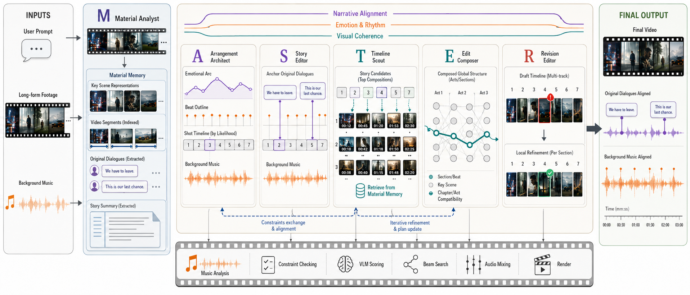
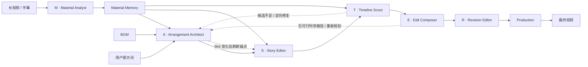

# CutMaster

[English](README_EN.md) | 简体中文

**CutMaster: Let the MASTER team edit.**

CutMaster 是一个面向长视频素材的多智能体自动剪辑框架。它将素材理解、节奏设计、故事锚定、候选检索、序列组接和成片复核拆分给六个职责明确的角色，在同一条剪辑链路中平衡：

- **叙事导向**：关键原声锚定情节、人物和提示词意图；
- **情绪导向**：Slot 结构跟随音乐段落、节拍和能量曲线；
- **视觉质量导向**：候选核验、运动过滤、转场评分和全局序列搜索共同控制画面质量。

> CutMaster employs a MASTER team of specialized agents that progressively transforms long-form footage into a narrative-aligned, emotionally paced, and visually coherent montage.

<p align="center">
  
</p>

<p align="center"><em>CutMaster 从长视频素材与用户意图出发，由 MASTER 团队协同完成素材理解、剪辑规划、序列优化与最终渲染。</em></p>

## MASTER Editing Team

CutMaster 将完整剪辑流程组织成一个 **MASTER** 团队：

| 字母 | 智能体 | 代码入口 | 剪辑职责 |
|---|---|---|---|
| **M** | **Material Analyst** | `analyser/material_analyst.py` | 建立 Shot、Segment、台词和故事摘要等可复用素材记忆 |
| **A** | **Arrangement Architect** | `planners/arrangement_architect.py` | 分析 BGM，编排 Slot 长度、剪辑节奏、情绪曲线和叙事结构 |
| **S** | **Story Editor** | `planners/story_editor.py` | 用关键原声锚定情节、人物弧光和提示词意图 |
| **T** | **Timeline Scout** | `planners/timeline_scout.py` | 沿原片时间线检索并验证每个 Slot 的候选镜头 |
| **E** | **Edit Composer** | `planners/edit_composer.py` | 综合单镜头质量与镜头衔接，用 Beam Search 组接最终序列 |
| **R** | **Revision Editor** | `planners/revision_editor.py` | 在候选池内审片、替换弱镜头并完成最终修订 |

其中：

```text
M       = Analyser
ASTER   = Planning team
M + ASTER = MASTER
```

`CutMaster` 是完整工作流的唯一入口，`ASTERTeam` 是五个规划智能体的唯一编排器。智能体之间不直接互相调用，所有前向协作与反馈修复都由团队编排器管理。

## 架构



完整调用关系：

```text
CLI
└── CutMaster
    ├── MaterialAnalystAgent
    ├── ASTERTeam
    │   ├── ArrangementArchitectAgent
    │   ├── StoryEditorAgent
    │   ├── TimelineScoutAgent
    │   ├── EditComposerAgent
    │   └── RevisionEditorAgent
    └── Production
        ├── source-window optimization
        ├── dialogue audio preparation
        └── frame-exact rendering
```

### 智能体与工具的边界

- **Agent 负责决策**：理解素材、规划结构、选择故事锚点、构造候选空间、组接序列和复核脚本。
- **Tool 负责能力**：ASR、缓存、音乐分析、媒体读取、运动计算、视觉评分和规划反馈等非智能体能力分别位于 `analyser/tools/` 与 `planners/tools/`。
- **Production 负责执行**：规划完成后进行源窗口优化、人声准备、FFmpeg 渲染和混音；它不是第七个智能体。
- **共享基础设施保持中立**：配置、契约、Prompt 注册和运行时能力分别位于 `configuration/`、`contracts/`、`prompting/` 与 `runtime/`。

## 核心机制

### 1. 可复用的 Material Memory

Material Analyst 先用 PySceneDetect 提取完整 Shot 边界并把 ASR 台词绑定到 Shot，再按 Scene-VLM 的 context-focus 方法，以 20 个连续 Shot 为上下文、中央 10 个 Shot 为判断目标、每个 Shot 三帧，顺序判断语义 Scene 边界。生成 Segment 后再执行逐 Shot 视觉标注、Segment 聚合和故事摘要。结果按素材与分析配置缓存在 `.cutmaster/materials/`，同一原片可被不同提示词和 BGM 复用。

Material Memory 独立于某一次剪辑方案，避免每次运行都重新理解整部视频。

### 2. 音乐驱动的 Slot 编排

Arrangement Architect 通过 `planners/tools/music_analysis.py` 提取节拍、重音、能量和音乐段落，并把目标时长编排为一组 Slot。每个 Slot 同时表达：

- 时间预算与节奏位置；
- 叙事功能和目标内容；
- 情绪、镜头尺度与运动倾向；
- 与前后 Slot 的结构关系。

Slot Planning 决定“成片需要什么”，而不是直接决定“使用哪个镜头”。

### 3. 原声台词作为故事锚点

Story Editor 从 Material Memory 中选择少量高价值原声台词，并将其固定到对应的源画面。锚点保证关键情节、人物关系和提示词意图不会被纯视觉蒙太奇稀释。

普通片段的原片声音保持静音；仅选中的 Dialogue Anchor 会经过人声准备后与 BGM 混合，并在台词区间自动压低背景音乐。

### 4. 候选空间与闭环修复

Timeline Scout 为非锚点 Slot 沿原片时间线检索候选，并验证主体身份、内容相关性、可见性和运动强度。候选不足时，它不会静默降级，而是把诊断返回 Arrangement Architect，触发定向 Slot 修复；如果 Slot 语义发生变化，Story Editor 会重新检查锚点。

### 5. 高效的全局序列选择

Edit Composer 同时考虑：

- 候选对当前 Slot 的单镜头适配度；
- 相邻镜头的视觉连续性与转场质量；
- 全片时间顺序等硬约束。

序列搜索采用 Beam Search。转场 VLM 评分只对仍可能进入最优路径的边进行惰性计算，在保留全局组合空间的同时控制推理成本。默认评分由 `0.60 × unary + 0.40 × pairwise` 组成。

### 6. 候选约束下的最终修订

Revision Editor 在已有候选池内审片和替换弱镜头，不绕过 Timeline Scout 临时生成未经验证的片段。最终脚本随后进入 Production，完成切点适配、帧精确渲染、人声混合和成片输出。

## 快速开始

### 环境要求

- Python `3.12`
- [uv](https://docs.astral.sh/uv/)
- FFmpeg 与 FFprobe
- 支持 OpenAI-compatible 接口的 LLM/VLM 服务
- 百炼 ASR 所需的 API Key

macOS 可使用：

```bash
brew install ffmpeg uv
```

### 安装

```bash
git clone <repository-url>
cd CutMaster
uv sync
```

复制环境变量模板：

```bash
cp .env.example .env
```

填写：

```dotenv
DASHSCOPE_API_KEY=your_api_key

# 可选：用于认证 Demucs 模型下载
HF_TOKEN=
```

CLI 会自动读取与 `config.toml` 同目录的 `.env`，且不会覆盖进程中已有的环境变量。

## 运行

### 命令行

```bash
uv run cutmaster run \
  --video /path/to/source.mp4 \
  --audio /path/to/bgm.mp3 \
  --prompt "剪出一支突出主角成长与最终胜利的高燃短片" \
  --output-dir /path/to/output \
  --target-duration 60 \
  --target-shot-length 4 \
  --config config.toml \
  --overwrite
```

也可以使用模块入口：

```bash
uv run python -m cutmaster run --help
```

常用可选参数：

| 参数 | 含义 |
|---|---|
| `--subtitle` | 使用已有字幕；未提供时运行 ASR |
| `--prompt-type` | 提示词类型，默认 `event` |
| `--video-title` | 提供给素材分析的片名 |
| `--max-clip-duration` | 限制单个候选片段的最长时长 |
| `--overwrite` | 覆盖已有输出并启动新一轮规划 |

### Python API

```python
from pathlib import Path

from cutmaster import CutMaster
from cutmaster.configuration.loader import load_config
from cutmaster.contracts.workflow import RunRequest

config = load_config(Path("config.toml"))
request = RunRequest(
    video_path=Path("/path/to/source.mp4"),
    audio_path=Path("/path/to/bgm.mp3"),
    prompt="剪出一支突出主角成长与最终胜利的高燃短片",
    output_dir=Path("/path/to/output"),
    target_output_length_sec=60,
    target_shot_length_sec=4,
    overwrite=True,
)

result = CutMaster(config).run(request)
print(result.output_video)
```

外部调用方和 Benchmark Adapter 应通过 `from cutmaster import CutMaster` 使用公共入口，不应依赖内部 Agent 或 Tool。

## 配置

默认配置位于 [`config.toml`](config.toml)。配置按职责边界组织：

| 配置段 | 所有者 | 主要内容 |
|---|---|---|
| `[llm]`, `[vlm]` | Runtime | 模型、接口、超时、重试和并发 |
| `[asr]`, `[shot_detection]`, `[shot_annotation]` | Material Analyst | 字幕生成、切镜和 Shot 标注 |
| `[material_analysis]` | Material Analyst | Material Memory 缓存目录 |
| `[slot_planning]` | Arrangement Architect | 目标镜头长度与重规划轮数 |
| `[dialogue_anchors]` | Story Editor / Production | 锚点数量、人声分离与混音参数 |
| `[candidate_retrieval]` | Timeline Scout | 候选数量、检索轮次和视觉验证 |
| `[beam_search]` | Edit Composer | Beam Search 宽度 |
| `[script_review]` | Revision Editor | 候选约束下的复核轮数 |
| `[source_window_optimization]`, `[render]` | Production | 切点搜索、画布、帧率、编码与音量 |

默认 LLM/VLM 请求超时为 `600` 秒，ASR 异步任务总等待时间为 `1800` 秒。所有字段的用途和默认值均在 `config.toml` 中就地说明。

## 输出产物

一次运行会在 `output_dir` 下保留可审计的中间结果：

| 产物 | 含义 |
|---|---|
| `output.mp4` | 最终视频 |
| `montage.mp4` | 最终混音前的画面蒙太奇 |
| `result.json` | 完整运行结果、耗时和产物路径 |
| `source.srt`, `dialogue_merged.srt`, `dialogues.json` | 原始与重建后的台词数据 |
| `music_profile.json` | 节拍、能量与音乐段落画像 |
| `edit_plan.json` | Arrangement Architect 生成的 Slot 方案 |
| `dialogue_anchors.json` | Story Editor 选中的原声锚点 |
| `candidate_pool.json` | Timeline Scout 构造的候选空间 |
| `selection_diagnostics.json` | Edit Composer 的路径与评分诊断 |
| `script_raw.json`, `script_adapted.json` | 修订前脚本与 Production 适配后的脚本 |
| `planning_history.json`, `planning_calls.json` | 规划反馈历史与模型调用树 |
| `cutmaster.log` | 结构化运行日志 |

素材级缓存目录还会保存 `video_description.json`、`video_summary.json` 和 `analysis_history.json`，用于跨任务复用与分析追踪。

## 源码结构

```text
src/cutmaster/
├── cutmaster.py                     # 完整工作流入口
├── analyser/
│   ├── material_analyst.py          # M
│   └── tools/                       # ASR、台词重建、缓存
├── planners/
│   ├── aster_team.py                # ASTER 团队编排器
│   ├── arrangement_architect.py     # A
│   ├── story_editor.py              # S
│   ├── timeline_scout.py            # T
│   ├── edit_composer.py             # E
│   ├── revision_editor.py           # R
│   └── tools/                       # 音乐分析、检索、验证、评分、反馈
├── production/                      # 脚本适配、音频与帧精确渲染
├── prompting/                       # Prompt 与响应契约注册
├── configuration/                   # 配置模型与加载
├── contracts/                       # 跨阶段数据契约
├── runtime/                         # 模型访问、上下文、日志、媒体基础设施
└── timecode.py                      # 时间码基础类型
```

详细的依赖边界和公共 API 参见 [`docs/architecture.md`](docs/architecture.md)，架构决策参见 [`docs/adr/`](docs/adr/)。

## 验证

```bash
uv run pytest
uv run cutmaster --help
uv run cutmaster run --help
```

## 当前范围

- 输入为一条长视频、一条 BGM，以及一个自然语言提示词；
- 输出为单条横屏视频；
- 时间线严格遵循原片顺序；
- 普通素材原声静音，仅保留选中的 Dialogue Anchor；
- 当前 ASR 后端为百炼；
- 默认依赖远程 LLM/VLM 服务，整体耗时受视频长度、候选数量、模型并发和人声分离影响。

## Attribution

CutMaster 的镜头检测基于 [PySceneDetect](https://www.scenedetect.com/)，音乐分析基于 [librosa](https://librosa.org/)，人声分离基于 [Demucs](https://github.com/facebookresearch/demucs)，媒体渲染基于 [FFmpeg](https://ffmpeg.org/)。
