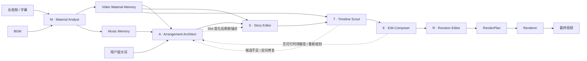

# CutMaster

[English](README_EN.md) | 简体中文

**CutMaster: Let the MASTER team edit.**

CutMaster 是一个面向长视频素材的多智能体自动剪辑框架。它将素材理解、节奏设计、故事锚定、候选检索、序列组接和成片复核拆分给六个职责明确的角色，在同一条剪辑链路中平衡：

- **叙事导向**：关键原声锚定情节、人物和提示词意图；
- **情绪导向**：Slot 结构跟随音乐段落、节拍和能量曲线；
- **视觉质量导向**：候选核验、运动过滤、转场评分和全局序列搜索共同控制画面质量。

> CutMaster employs a MASTER team of specialized agents that progressively transforms long-form footage into a narrative-aligned, emotionally paced, and visually coherent montage.

<p align="center">
  
</p>

<p align="center"><em>CutMaster 从长视频素材与用户意图出发，由 MASTER 团队协同完成素材理解、剪辑规划、序列优化与最终渲染。</em></p>

## MASTER Editing Team

CutMaster 将完整剪辑流程组织成一个 **MASTER** 团队：

| 字母 | 智能体 | 代码入口 | 剪辑职责 |
|---|---|---|---|
| **M** | **Material Analyst** | `analyser/material_analyst.py` | 建立视频的 Shot、Segment、台词与故事摘要，以及完整音乐的可复用素材记忆 |
| **A** | **Arrangement Architect** | `planners/arrangement_architect.py` | 将 Music Memory 投影到目标时长，编排 Slot 长度、剪辑节奏、情绪曲线和叙事结构 |
| **S** | **Story Editor** | `planners/story_editor.py` | 用关键原声锚定情节、人物弧光和提示词意图 |
| **T** | **Timeline Scout** | `planners/timeline_scout.py` | 沿原片时间线检索并验证每个 Slot 的候选镜头 |
| **E** | **Edit Composer** | `planners/edit_composer.py` | 综合单镜头质量与镜头衔接，用 Beam Search 组接最终序列 |
| **R** | **Revision Editor** | `planners/revision_editor.py` | 在候选池内审片、替换弱镜头并完成最终修订 |

其中：

```text
M       = Analyser
ASTER   = Planning team
M + ASTER = MASTER
```

`Orchestrator` 是完整工作流入口；`Analyser`、`Planner` 和 `Renderer` 也可以独立调用。`ASTERTeam` 是五个规划智能体的唯一编排器。智能体之间不直接互相调用，所有前向协作与反馈修复都由团队编排器管理。

## 架构



完整调用关系：

```text
CLI
└── Orchestrator
    ├── Analyser
    │   └── MaterialAnalystAgent
    ├── Planner
    │   └── ASTERTeam
    │   ├── ArrangementArchitectAgent
    │   ├── StoryEditorAgent
    │   ├── TimelineScoutAgent
    │   ├── EditComposerAgent
    │   └── RevisionEditorAgent
    │   └── plan compiler / source-window optimization
    └── Renderer
        ├── dialogue audio preparation
        └── frame-exact rendering
```

### 智能体与工具的边界

- **Agent 负责决策**：理解素材、规划结构、选择故事锚点、构造候选空间、组接序列和复核脚本。
- **Tool 负责能力**：ASR、素材库、完整音乐分析、媒体读取、Music Profile 投影、运动计算、视觉评分和规划反馈等非智能体能力分别位于 `analyser/tools/` 与 `planners/tools/`。
- **Planner 交付精确计划**：源窗口优化、Beat 微调和输出帧分配都属于剪辑决策，最终固化为不可变的 `RenderPlan`。
- **Renderer 负责执行**：只按照 `RenderPlan` 准备人声、执行 FFmpeg 渲染和混音，不访问 LLM/VLM，也不修改规划。
- **共享基础设施保持中立**：配置、契约、Prompt 注册和运行时能力分别位于 `configuration/`、`contracts/`、`prompting/` 与 `runtime/`。

## 核心机制

### 1. Material Library 与可复用的 Material Memory

Material Library 保存视频和音乐的只读托管副本，并用唯一的 **Material Name** 作为公开身份。未显式指定名称时，CLI 使用源文件的 filename stem 作为候选名；同一素材类型内，同一候选名称族与相同 SHA-256 再次添加时直接复用已有 Material 及其分析结果，同名但内容不同时则依次分配 `Name (2)`、`Name (3)`。即使文件内容相同，只要显式使用了不同候选名，也会建立两个可独立选择的 Material。

SHA-256 仅作为内部一致性校验，不拼入 Material Name，也不作为 CLI 选择参数。若托管源文件与记录的指纹不一致，该 Material 会被阻止进入分析、规划和渲染；当前素材只支持添加和删除，不支持就地替换。

已完成的 Material Memory 会直接复用；中断的视频分析只能在字幕与分析规格未变时继续，防止不同输入的 checkpoint 被混合。

Material Analyst 对视频使用 PySceneDetect 提取完整 Shot 边界并把 ASR 台词绑定到 Shot，再按 Scene-VLM 的 context-focus 方法判断语义 Scene 边界、生成逐镜头视觉标注、Segment 聚合和故事摘要。它也对完整音乐提取节拍、重音、能量和段落。两类结果分别形成 Video Material Memory 与 Music Memory，并缓存在 `.cutmaster/materials/`，独立于某一次剪辑请求。

### 2. 音乐驱动的 Slot 编排

完整曲目的分析由 Analyser 中的 Material Analyst 完成。Planner 不重新解码和分析音乐；Arrangement Architect 从可复用 Music Memory 出发，根据本次目标时长进行截断或循环投影，生成 Planning 专属的 Music Profile，再把时间线编排为一组 Slot。每个 Slot 同时表达：

- 时间预算与节奏位置；
- 叙事功能和目标内容；
- 情绪、镜头尺度与运动倾向；
- 与前后 Slot 的结构关系。

Slot Planning 决定“成片需要什么”，而不是直接决定“使用哪个镜头”。

### 3. 原声台词作为故事锚点

Story Editor 从 Material Memory 中选择少量高价值原声台词，并将其固定到对应的源画面。锚点保证关键情节、人物关系和提示词意图不会被纯视觉蒙太奇稀释。

普通片段的原片声音保持静音；仅选中的 Dialogue Anchor 会经过人声准备后与 BGM 混合，并在台词区间自动压低背景音乐。

### 4. 候选空间与闭环修复

Timeline Scout 为非锚点 Slot 沿原片时间线检索候选，并验证主体身份、内容相关性、可见性和运动强度。候选不足时，它不会静默降级，而是把诊断返回 Arrangement Architect，触发定向 Slot 修复；如果 Slot 语义发生变化，Story Editor 会重新检查锚点。

### 5. 高效的全局序列选择

Edit Composer 同时考虑：

- 候选对当前 Slot 的单镜头适配度；
- 相邻镜头的视觉连续性与转场质量；
- 全片时间顺序等硬约束。

序列搜索采用 Beam Search。转场 VLM 评分只对仍可能进入最优路径的边进行惰性计算，在保留全局组合空间的同时控制推理成本。默认评分由 `0.60 × unary + 0.40 × pairwise` 组成。

### 6. 候选约束下的最终修订

Revision Editor 在已有候选池内审片和替换弱镜头，不绕过 Timeline Scout 临时生成未经验证的片段。Planner 随后完成切点适配并生成精确到帧的 `RenderPlan`；Renderer 可以反复复用该计划生成纯 BGM 或带原声版本。

## 快速开始

### 环境要求

- Python `3.12`
- [uv](https://docs.astral.sh/uv/)
- FFmpeg 与 FFprobe
- 支持 OpenAI-compatible 接口的 LLM/VLM 服务
- 百炼 ASR 所需的 API Key

macOS 可使用：

```bash
brew install ffmpeg uv
```

### 安装

```bash
git clone <repository-url>
cd CutMaster
uv sync
```

复制环境变量模板：

```bash
cp .env.example .env
```

填写：

```dotenv
DASHSCOPE_API_KEY=your_api_key

# 可选：用于认证 Demucs 模型下载
HF_TOKEN=
```

CLI 会自动读取与 `config.toml` 同目录的 `.env`，且不会覆盖进程中已有的环境变量。

## 运行

### 命令行

```bash
uv run cutmaster run \
  --video /path/to/source.mp4 \
  --audio /path/to/bgm.mp3 \
  --prompt "剪出一支突出主角成长与最终胜利的高燃短片" \
  --output-dir /path/to/output \
  --target-duration 60 \
  --target-shot-length 4 \
  --audio-mode bgm_only \
  --config config.toml \
  --overwrite
```

`run --video/--audio` 保持兼容：传入原始路径时，CutMaster 会先把文件加入 Material Library。默认候选 Material Name 是文件名 stem，也可以分别用 `--video-material-name` 和 `--music-material-name` 指定。命令输出中的 `video_material_name` 与 `music_material_name` 是实际分配的公开名称；后续可按该名称精确复用已完成分析的素材：

```bash
uv run cutmaster run \
  --video-material "feature-film" \
  --music-material "trailer-score" \
  --prompt "剪出一支突出主角成长与最终胜利的高燃短片" \
  --output-dir /path/to/output \
  --target-duration 60 \
  --config config.toml
```

`--video-material` 与 `--music-material` 接收精确 Material Name，而不是文件路径或 SHA-256；被选择的素材必须已经完成对应分析。

也可以使用模块入口：

```bash
uv run python -m cutmaster run --help
```

常用可选参数：

| 参数 | 含义 |
|---|---|
| `--subtitle` | 使用已有字幕；未提供时运行 ASR |
| `--prompt-type` | 提示词类型，默认 `event` |
| `--video-title` | 提供给素材分析的片名 |
| `--material-name` | `analyse` / `analyse-music` 添加素材时使用的候选名称；默认取 filename stem |
| `--video-material-name` | `run` 通过原始视频路径添加素材时使用的候选名称 |
| `--music-material-name` | `plan` / `run` 通过原始音乐路径添加素材时使用的候选名称 |
| `--video-material`, `--music-material` | 按精确 Material Name 选择已完成分析的视频和音乐素材 |
| `--max-clip-duration` | 限制单个候选片段的最长时长 |
| `--audio-mode` | `bgm_only` 或 `dialogue` |
| `--overwrite` | 覆盖已有输出并启动新一轮规划 |

三个阶段也可以独立运行：

```bash
uv run cutmaster analyse \
  --video source.mp4 \
  --material-name "feature-film" \
  --output-dir artifacts/cutmaster/analyser

uv run cutmaster analyse-music \
  --audio bgm.mp3 \
  --material-name "trailer-score" \
  --output-dir artifacts/cutmaster/analyser/music

uv run cutmaster plan \
  --video-material "feature-film" \
  --music-material "trailer-score" \
  --prompt "..." \
  --output-dir artifacts/cutmaster/planners

uv run cutmaster render --plan artifacts/cutmaster/planners/render_plan.json --audio-mode dialogue --output-dir artifacts/cutmaster/renderer
```

`plan` 也接受显式分析结果路径：视频使用 `--analysis-result`，音乐使用 `--music-analysis-result`。为兼容原有调用，音乐还可以直接通过 `--audio` 传入；此时 Analyser 会先建立或复用对应的 Music Memory，再进入 Planner。

### Python API

```python
from pathlib import Path

from cutmaster import Orchestrator
from cutmaster.configuration.loader import load_config
from cutmaster.contracts.workflow import WorkflowRequest

config = load_config(Path("config.toml"))
request = WorkflowRequest(
    video_path=Path("/path/to/source.mp4"),
    audio_path=Path("/path/to/bgm.mp3"),
    prompt="剪出一支突出主角成长与最终胜利的高燃短片",
    output_dir=Path("/path/to/output"),
    target_output_length_sec=60,
    target_shot_length_sec=4,
    audio_mode="bgm_only",
    overwrite=True,
)

result = Orchestrator(config).run(request)
print(result.output_video)
```

外部调用方和 Benchmark Adapter 应通过 `Orchestrator` 使用完整入口，或通过 `Analyser`、`Planner`、`Renderer` 调用单独阶段，不应依赖内部 Agent 或 Tool。

## 配置

默认配置位于 [`config.toml`](config.toml)。配置按职责边界组织：

| 配置段 | 所有者 | 主要内容 |
|---|---|---|
| `[llm]`, `[vlm]` | Runtime | 模型、接口、超时、重试和并发 |
| `[analyser.*]` | Analyser | Material Library、ASR、切镜、Scene/Shot 标注、完整音乐分析和素材缓存 |
| `[planners.slot_planning]` | Arrangement Architect | 目标镜头长度与重规划轮数 |
| `[planners.dialogue_anchors]` | Story Editor | 锚点数量和最短时长 |
| `[planners.candidate_retrieval]` | Timeline Scout | 候选数量、检索轮次和视觉验证 |
| `[planners.beam_search]` | Edit Composer | Beam Search 宽度 |
| `[planners.script_review]` | Revision Editor | 候选约束下的复核轮数 |
| `[planners.source_window_optimization]` | Plan Compiler | 源区间切点搜索 |
| `[renderer]`, `[renderer.dialogue_audio]` | Renderer | 画布、编码、人声分离和混音 |

默认 LLM/VLM 请求超时为 `600` 秒，ASR 异步任务总等待时间为 `1800` 秒。所有字段的用途和默认值均在 `config.toml` 中就地说明。

## 输出产物

一次运行按阶段保存产物：

| 产物 | 含义 |
|---|---|
| `result.json` | 完整运行结果、耗时和产物路径 |
| `analyser/analysis_result.json` | 本次使用的 Video Material Memory 正式索引 |
| `analyser/source.srt`, `dialogue_merged.srt`, `dialogues.json` | 原始与重建后的台词数据 |
| `analyser/music/music_analysis_result.json` | 本次使用的 Music Memory 正式索引 |
| `analyser/music/music_memory.json` | 完整源曲目的节拍、重音、能量与段落分析 |
| `planners/render_plan.json` | Planner 交付给 Renderer 的不可变、帧精确计划 |
| `planners/music_profile.json`, `edit_plan.json`, `dialogue_anchors.json`, `candidate_pool.json`, `script_raw.json` | 本次目标时长的 Music Profile 与其他 Planning 中间产物 |
| `planners/diagnostics/` | Beam 诊断、规划历史和模型调用树 |
| `renderer/montage.mp4` | 可跨音频版本复用的无声蒙太奇 |
| `renderer/output.mp4` | 当前 Render 的最终视频 |
| `renderer/render_request.json`, `render_result.json` | 渲染请求与结果 |
| `cutmaster.log` | 结构化运行日志 |

Material Library 的清单与托管素材位于配置指定的 `.cutmaster/materials/`。每个视频 Material 的分析目录保存 `video_description.json`、`video_summary.json` 和 `analysis_history.json`，每个音乐 Material 的分析目录保存 `music_memory.json`；CLI 通过 Material Name 解析这些缓存，而不要求调用方持有缓存路径。

## 源码结构

```text
src/cutmaster/
├── orchestrator.py                  # 三阶段完整工作流入口
├── analyser/
│   ├── analyser.py                  # Analyser 公共服务
│   ├── material_analyst.py          # M
│   └── tools/                       # Material Library、ASR、台词重建、视频缓存、完整音乐分析
├── planners/
│   ├── planner.py                   # Planner 公共服务
│   ├── plan_compiler.py             # 帧时间线与 RenderPlan 编译
│   ├── source_window_optimizer.py   # 源区间优化
│   ├── aster_team.py                # ASTER 团队编排器
│   ├── arrangement_architect.py     # A
│   ├── story_editor.py              # S
│   ├── timeline_scout.py            # T
│   ├── edit_composer.py             # E
│   ├── revision_editor.py           # R
│   └── tools/                       # Music Profile 投影、检索、验证、评分、反馈
├── renderer/                        # 独立音频准备与帧精确渲染
├── prompting/                       # Prompt 与响应契约注册
├── configuration/                   # 配置模型与加载
├── contracts/                       # 跨阶段数据契约
├── runtime/                         # 模型访问、上下文、日志、媒体基础设施
└── timecode.py                      # 时间码基础类型
```

详细的依赖边界和公共 API 参见 [`docs/architecture.md`](docs/architecture.md)，架构决策参见 [`docs/adr/`](docs/adr/)。

## 验证

```bash
uv run pytest
uv run cutmaster --help
uv run cutmaster run --help
```

## 当前范围

- 输入为一条长视频、一条 BGM，以及一个自然语言提示词；
- 输出为单条横屏视频；
- 时间线严格遵循原片顺序；
- 普通素材原声静音，仅保留选中的 Dialogue Anchor；
- 当前 ASR 后端为百炼；
- 默认依赖远程 LLM/VLM 服务，整体耗时受视频长度、候选数量、模型并发和人声分离影响。

## Attribution

CutMaster 的镜头检测基于 [PySceneDetect](https://www.scenedetect.com/)，音乐分析基于 [librosa](https://librosa.org/)，人声分离基于 [Demucs](https://github.com/facebookresearch/demucs)，媒体渲染基于 [FFmpeg](https://ffmpeg.org/)。
