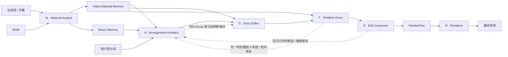

# CutMaster

[English](README_EN.md) | 简体中文

**CutMaster: Let the MASTER team edit.**

CutMaster 是一个面向长视频素材的多智能体自动剪辑框架。它将素材理解、节奏设计、故事锚定、候选检索、序列组接和成片复核拆分给六个职责明确的角色，在同一条剪辑链路中平衡：

- **叙事导向**：关键原声锚定情节、人物和提示词意图；
- **情绪导向**：Slot 结构跟随音乐段落、节拍和能量曲线；
- **视觉质量导向**：候选核验、运动过滤、转场评分和全局序列搜索共同控制画面质量。

> CutMaster employs a MASTER team of specialized agents that progressively transforms long-form footage into a narrative-aligned, emotionally paced, and visually coherent montage.

<p align="center">
  
</p>

<p align="center"><em>CutMaster 从长视频素材与用户意图出发，由 MASTER 团队协同完成素材理解、剪辑决策、序列优化与最终渲染。</em></p>

## MASTER Editing Team

CutMaster 将完整剪辑流程组织成一个 **MASTER** 团队：

| 字母        | 智能体                          | 代码入口                                       | 剪辑职责                                                                     |
| ----------- | ------------------------------- | ---------------------------------------------- | ---------------------------------------------------------------------------- |
| **M** | **Material Analyst**      | `workflow/analyser/material_analyst.py`      | 建立视频的 Shot、Segment、台词与故事摘要，以及完整音乐的可复用素材记忆       |
| **A** | **Arrangement Architect** | `workflow/planners/arrangement_architect.py` | 编排 Slot，并把相邻 Slot 分组后绑定到同一个 Segment                           |
| **S** | **Story Editor**          | `workflow/planners/story_editor.py`          | 用关键原声锚定故事，并把同组普通 Slot 切分到锚点前后的子 Segment               |
| **T** | **Timeline Scout**        | `workflow/planners/timeline_scout.py`        | 为每个 Slot Group 检索、验证不可拆分的完整候选轨迹                            |
| **E** | **Edit Composer**         | `workflow/planners/edit_composer.py`         | 以完整轨迹为单位，用 Beam Search 组接满足时序的最终序列                        |
| **R** | **Renderer** | `workflow/renderer/renderer.py` | 按冻结的 RenderPlan 执行渲染，不再进行模型复核 |

其中：

```text
M       = Analyser
A/S/T/E = Planners team
R       = Renderer
ASTER   = Planning + rendering
M + ASTER = MASTER
```

CLI、FastAPI Web、Worker 与 Benchmark Adapter 是四个平级入口。CLI 和
Benchmark 的同步完整流程调用 `CutMasterApplication.workflows`；Web 将 HTTP/SSE
请求转换为 Application use case；Worker 执行 Application 已持久化的 durable Job。
Application Layer 负责托管素材、项目、Run、Frozen Edit、Render Variant 与 Job
生命周期，再由 `ASTERTeam` 统一编排四个规划智能体；R · Renderer 由 Application 独立调度。智能体之间不直接互相调用，
所有前向协作与反馈修复都由团队编排器管理。

## 架构

> 当前已实现 `CutMasterApplication`、Managed Workflow Coordinator、
> Material/Run/Render executors、durable Job executor、SQLite 管理状态、
> handle-only v2 Workflow 契约与 Managed Artifact Manifest，
> 以及 FastAPI + React/Vite 本地 Web 工作台。CLI、Web 和
> Mashup-Benchmark 均经由 Application Layer 调用真实后端。Web 已支持素材
> 导入、分析、预览与完整恢复动作；ASTER Run 的启动、重试、边界续跑、再次
> 运行、删除与用量查看；Frozen Edit Review、原子 Guided Revision；以及由
> 严格 Render Specification 驱动的 Renderer、Dialogue Preview、Render
> Variant 和 Outputs。统一的本地任务 supervisor 负责 FIFO、容量、同属主
> 串行化与孤儿恢复，durable SSE 支持 `Last-Event-ID` 重放与全量重同步。
> Provider/Setup、连接测试、原子本地配置写入和受保护的 Data Root Migration
> 也已连接真实后端，不使用模拟接口。



完整调用关系：

```text
CLI Adapter -----------> CutMasterApplication.workflows
Benchmark Adapter -----> CutMasterApplication.workflows
FastAPI Web Adapter ---> CutMasterApplication grouped use cases
Worker Adapter --------> ManagedJobExecutor
                                   │
                                   └── Application Layer
                                       ├── ManagedWorkflowCoordinator
                                       ├── ManagedMaterialAnalysisExecutor
                                       │   └── Analyser → MaterialAnalystAgent
                                       ├── RunPlanningExecutor
                                       │   └── Planners → ASTERTeam → A/S/T/E/R
                                       └── ManagedRenderExecutor → Renderer
```

Adapter 只转换各自的协议：CLI 负责参数、终端输出与退出码，FastAPI 负责 HTTP/SSE，
Worker 负责一个 durable Job 的进程入口，Benchmark Adapter 负责评测任务转换和提交
副本导出。它们彼此不调用，也不直接构造 Agent、Tool、Repository 或输出目录。

### 智能体与工具的边界

- **Agent 负责决策**：理解素材、规划结构、选择故事锚点、构造候选空间、组接序列和复核脚本。
- **Tool 负责能力**：ASR、完整音乐分析、媒体读取、Music Profile 投影、运动计算、视觉评分和 ASTER 协作反馈分别位于 `workflow/analyser/tools/` 与 `workflow/planners/tools/`；素材生命周期属于 `app.materials`。
- **Planners 交付精确计划**：源窗口优化、Beat 微调和输出帧分配都属于剪辑决策，最终固化为不可变的 `RenderPlan`。
- **Renderer 负责执行**：只按照 `RenderPlan` 准备人声、执行 FFmpeg 渲染和混音，不访问 LLM/VLM，也不修改规划。
- **分层边界清晰**：配置、托管 Application 契约、阶段契约、Workflow Prompt 和具体基础设施分别位于 `configuration/`、`application/workflow/`、`workflow/contracts/`、`workflow/prompting/` 与 `infrastructure/`。

## 核心机制

### 1. Material Library 与可复用的 Material Memory

Material Library 保存视频和音乐的只读托管副本。每个 Material 都有一个不透明的内部 **Material ID**，但用户与 CLI 始终通过 `(Material Type, exact Material Name)` 选择素材。未显式指定名称时，CLI 使用源文件的 filename stem；同一素材类型内 Material Name 唯一，`app.materials.add()` 遇到重名一律报冲突，系统不会自动追加 `(2)`、覆盖或替换。`analyse` 以及 `run --video/--audio` 使用 `app.materials.ensure()` 提供幂等性：只有同类型、同名、同指纹的既有绑定会返回同一个 Material ID；同名但内容不同仍会报冲突。即使文件内容相同，只要使用不同的可用名称，也会建立两个可独立选择的 Material。

SHA-256 记录在 Material 清单条目中，仅作为内部一致性校验，不参与 Material ID 或目录命名，也不作为 CLI 选择参数。若托管源文件与记录的指纹不一致，该 Material 会被阻止进入分析、规划和渲染。Web Material Library 已提供受引用关系和活动 Attempt 保护的永久删除；CLI 仍以添加、确保和精确名称复用为主。不支持就地替换。

已完成的 Material Memory 会直接复用；中断的视频分析只能在字幕与分析规格未变时继续，防止不同输入的 checkpoint 被混合。

Material Analyst 对视频使用 PySceneDetect 提取完整 Shot 边界并把 ASR 台词绑定到 Shot，再按 Scene-VLM 的 context-focus 方法判断语义 Scene 边界、生成逐镜头视觉标注、Segment 聚合和故事摘要。它也对完整音乐提取节拍、重音、能量和段落。两类结果分别形成 Video Material Memory 与 Music Memory，并保存在 `.cutmaster/media/<type>/mat_<uuid>/analysis/`，独立于某一次剪辑请求。

### 2. 音乐驱动的 Slot 编排

完整曲目的分析由 Analyser 中的 Material Analyst 完成。Planners 不重新解码和分析音乐；Arrangement Architect 从可复用 Music Memory 出发，根据本次目标时长进行截断或循环投影，生成当前 Planners 调用专属的 Music Profile，再把时间线编排为一组 Slot。每个 Slot 同时表达：

- 时间预算与节奏位置；
- 叙事功能和目标内容；
- 情绪、镜头尺度与运动倾向；
- 与前后 Slot 的结构关系。

相邻 Slot 可以绑定到同一个 Segment，并组成一个 Slot Group；只有同组 Slot 的
Segment 编号相同，组与组之间的 Segment 编号严格递增。音乐对齐完成后，系统以毫秒
检查同组 Slot 的总时长能否放入该 Segment；放不下就拒绝本次 Arrangement 返回，
携带所需时长和可用时长重新规划。

Slot Arrangement 决定“成片需要什么、每组使用哪个 Segment”，而不是直接决定
“使用哪个镜头”。

### 3. 原声台词作为故事锚点

Story Editor 从 Material Memory 中选择少量高价值原声台词，并将其固定到对应的源画面。锚点保证关键情节、人物关系和提示词意图不会被纯视觉蒙太奇稀释。

如果锚点落在一个多 Slot 的组内，锚点 Slot 会退出普通检索；锚点固定画面前后
连续的普通 Slot 分别形成子组，并绑定到锚点画面切出的子 Segment，例如
`segment_0010_01`、`segment_0010_02`。每个子 Segment 也必须容纳其子组的总时长；
多个返回 Anchor 冲突或造成无解分区时，后端会保留数量最多的合法子集；没有强而合法的
原声时允许不设 Anchor。Story Editor 选择连续台词端点，完整画面区间和分区容量由后端校验。

普通片段的原片声音保持静音；仅选中的 Dialogue Anchor 会经过人声准备后与 BGM 混合，并在台词区间自动压低背景音乐。

### 4. 候选空间与闭环修复

Timeline Scout 以 Slot Group 为最小单位检索。一次候选轨迹必须为组内每个 Slot
提供一个片段，片段全部位于该组绑定的 Segment 或子 Segment 内，并按 Slot 顺序
排列且互不重叠。任一片段没有通过时长、运动或 VLM 核验，整条轨迹都会被拒绝，
不能把不同轨迹中的片段混在一起。

每组只发起一次批量检索，默认请求 3 条完整轨迹并逐条校验；允许少于 3 条或空数组，
不会为凑数重试，任意一条通过即可进入下一阶段。模型、媒体或 VLM 执行异常直接上抛，
缺帧不会被视为静态。正常返回空数组，或整批候选都被语义或视觉规则拒绝时，
才把该组的具体拒绝证据立即交给 Arrangement Architect；
该 Group 与 Segment 的失败绑定会被后端禁止重用。若整批所有候选的所有片段都为静态，
该 Segment 会被标记为素材不可用。局部修复保留仍合法的旧 Anchor，确定性重建 Story
分区，并只重新检索合同发生变化的完整组；其他组按精确合同复用候选。检索不会把单个
Slot 扩展到相邻 Segment。

### 5. 高效的全局序列选择

Edit Composer 同时考虑：

- 轨迹内各片段对对应 Slot 的适配度；
- 轨迹内部以及相邻组之间的视觉连续性与转场质量；
- 全片时间顺序等硬约束。

序列搜索采用 Beam Search，并且每次选择的是一整条组轨迹。重叠、倒序或拆分轨迹
的路径会直接淘汰；保留一个中间选择前，还会确认它能够接到后续组的至少一条合法
路径，避免搜索走到末尾才发现无解。转场 VLM 评分只对仍可能进入最优路径的边进行
惰性计算，在保留全局组合空间的同时控制推理成本。默认评分由
`0.60 × unary + 0.40 × pairwise` 组成。

### 6. 冻结方案与渲染

Edit Composer 的选择直接编译为精确到帧的 `RenderPlan`，由 R · Renderer 渲染。
不再执行自动 Revision Editor；前端的人工 Guided Revision 保持独立。

## Case Study：《教父》的权力交接

下面的案例展示了 CutMaster 如何响应“剪出《教父》中权力交接的关键事件，包括家族会面、刺杀危机、反击计划与权力巩固”的提示词。Material Memory 提供完整影片的可检索故事与视觉上下文，背景音乐则定义 60 秒成片的节奏骨架。

<p align="center">
  <a href="assets/case-study-the-godfather.png">
    
  </a>
</p>

<p align="center"><em>从提示词和 Material Memory 出发，ASTER 团队将《教父》的权力交接叙事编排、锚定、检索、组接并渲染为一条 60 秒时间线。点击图片可查看完整尺寸。</em></p>

- **Arrangement Architect** 将音乐结构映射为“权威建立—刺杀危机—迈克尔反击—失去与继承—权力巩固”五幕，把相邻 Slot 分组并为每组固定 Segment、主体和时长约束。
- **Story Editor** 用具有叙事转折价值的原声台词固定关键情节，并用锚点画面把同组普通 Slot 切分到前后的子 Segment；长台词仍可通过 L-cut 跨越相邻画面 Slot。
- **Timeline Scout** 为每个普通 Slot Group 验证多条完整轨迹；当任一片段的人物身份、视觉相关性或主体可见性不合格时，拒绝整条轨迹并重新检索。
- **Edit Composer** 联合片段得分、轨迹内部和组间镜头兼容度，在候选图上搜索可延伸到结尾的全局最优时序路径。
- **Renderer** 按冻结方案执行视频和音频渲染，不改变候选选择。

## 快速开始

### 环境要求

- Python `3.12`
- [uv](https://docs.astral.sh/uv/)
- FFmpeg 与 FFprobe
- 支持 OpenAI-compatible 接口的 LLM/VLM 服务
- 默认配置所需的 DeepSeek 与阿里云百炼 API Key；也可以让所有模型服务统一使用百炼

macOS 可使用：

```bash
brew install ffmpeg uv
```

### 安装

```bash
git clone <repository-url>
cd CutMaster
uv sync
```

复制环境变量模板：

```bash
cp .env.example .env
```

默认配置以成本优先：文本 LLM 使用 DeepSeek，VLM 与 ASR 使用 DashScope，需要填写两个 API Key：

```dotenv
DEEPSEEK_API_KEY=your_deepseek_api_key
DASHSCOPE_API_KEY=your_dashscope_api_key

# 可选：用于认证 Demucs 模型下载
HF_TOKEN=
```

默认配置让 LLM、VLM 和 ASR 全部使用 DashScope，因此 `.env` 只需填写：

```dotenv
DASHSCOPE_API_KEY=your_dashscope_api_key
```

CLI 会自动读取与 `config.toml` 同目录的 `.env`，且不会覆盖进程中已有的环境变量。

## 运行

### 本地 Web 工作台

首次检出代码后安装前端依赖，然后启动本地应用：

```bash
npm --prefix web ci
uv run cutmaster serve --config config.toml
```

在源码工作树中，`serve` 会在打开浏览器前检查 `web/dist`；当产物缺失或落后于
前端源码时会自动执行生产构建。也可以随时手动运行
`npm --prefix web run build`。已打开的旧页面在构建更新后需要刷新一次。

默认在 `http://127.0.0.1:8000` 打开。Web 工作台使用真实 Application 数据
提供 Projects、Material Library、Video/Music Memory Explorer、Activity 和
Settings。素材可以通过 Web 预检、导入（视频可携带可选 SRT）并排入真实
Analyser；失败或中断后可 Retry/Resume，活动工作可 Stop，删除受引用与运行
状态保护。独立生成且无标注的视频 JPEG 封面与柱状音乐能量预览都是有界
资源，不会读取 Shot 帧缓存，也不会把完整源媒体嵌入列表响应。

项目内部使用 **Project Setup / Runs / Outputs** 三个标签。保存素材、剪辑
意图与目标时长后，**Start editing** 创建不可变 ASTER Run，并由本地子进程
执行真实 Planners。失败 Run 可 Retry；中断 Run 仅从已校验的完整 A/S/T/E/R
代理边界（包括待重新规划边界）Resume；成功 Run 可 Run again，历史 Run 可在
安全时永久删除。Run 详情和 Activity 展示统一的持久化进度与模型用量。

Frozen Edit 打开真实 Review；每个 Frozen Edit 必须关联完整且通过完整性校验的
Candidate Bundle，支持候选约束内的原子 Guided Revision。Bundle 缺失、损坏或
selected candidate 不完整时返回 `review_artifact_unavailable`，不提供只读降级。
严格、不可变的 Render
Specification 驱动真实 Renderer Attempt、自动 Dialogue Preview、BGM-only
Variant、播放、Range 下载、Finder、完整性验证、Render again 和安全删除。
统一 `LocalJobSupervisor` 为 Analyser、Planners 和 Renderer 提供 FIFO、容量、
同属主串行化与孤儿恢复；全局 SSE 连接通过 `Last-Event-ID` 重放 durable 事件，
必要时触发 `resync_required` 后的 REST 重同步。

Settings/首次 Setup 支持 Provider 预设或自定义 OpenAI-compatible 连接、分能力
连接测试、原子 `.env`/`config.toml` 写入和受保护的 Data Root Migration。当前
仍有意保留为后续工作的范围包括持久化应用内通知、Activity 日志抽屉、OpenAPI
生成的 TypeScript 漂移 CI、多用户/云部署，以及更完整的 provider/media port
注入。

### 命令行

```bash
uv run cutmaster run \
  --video /path/to/source.mp4 \
  --audio /path/to/bgm.mp3 \
  --prompt "剪出一支突出主角成长与最终胜利的高燃短片" \
  --project-name "主角成长混剪" \
  --target-duration 60 \
  --target-shot-length 4 \
  --audio-mode bgm_only \
  --config config.toml
```

CLI 不再接受 `--output-dir`。命令会创建与 WebUI 完全相同的 Material、Edit
Project、ASTER Run、Execution Attempt、Frozen Edit 和 Render Variant；规范产物
统一存入当前 Application Data Root，并可直接在 WebUI 的 Projects、Runs 和
Outputs 中查看。

`run --video/--audio` 保持兼容：传入原始路径时，CutMaster 会先确保对应 Material 存在。默认 Material Name 是文件名 stem，也可以分别用 `--video-material-name` 和 `--music-material-name` 指定。名称不会被自动修改；同名但指纹不同会直接报冲突。命令输出中的 `video_material_name` 与 `music_material_name` 是通过校验后保留的公开名称；后续可按该名称精确复用已完成分析的素材：

```bash
uv run cutmaster run \
  --video-material "feature-film" \
  --music-material "trailer-score" \
  --prompt "剪出一支突出主角成长与最终胜利的高燃短片" \
  --project-name "素材复用示例" \
  --target-duration 60 \
  --config config.toml
```

`--video-material` 与 `--music-material` 接收精确 Material Name，而不是文件路径或 SHA-256；被选择的素材必须已经完成对应分析。

也可以使用模块入口：

```bash
uv run python -m cutmaster run --help
```

常用可选参数：

| 参数                                       | 含义                                                                           |
| ------------------------------------------ | ------------------------------------------------------------------------------ |
| `--subtitle`                             | 使用已有字幕；未提供时运行 ASR                                                 |
| `--prompt-type`                          | 提示词类型，默认`event`                                                      |
| `--video-title`                          | 提供给素材分析的片名                                                           |
| `--material-name`                        | `analyse` / `analyse-music` 添加素材时使用的候选名称；默认取 filename stem |
| `--video-material-name`                  | `run` 通过原始视频路径添加素材时使用的候选名称                               |
| `--music-material-name`                  | `run` 通过原始音乐路径添加素材时使用的候选名称                             |
| `--video-material`, `--music-material` | 按精确 Material Name 选择已完成分析的视频和音乐素材                            |
| `--project-name`                        | 新建的 WebUI 可见 Edit Project 名称                                           |
| `--max-clip-duration`                    | 限制单个候选片段的最长时长                                                     |
| `--audio-mode`                           | `bgm_only` 或 `dialogue`                                                   |

三个阶段也可以独立运行：

```bash
uv run cutmaster analyse \
  --video source.mp4 \
  --material-name "feature-film"

uv run cutmaster analyse-music \
  --audio bgm.mp3 \
  --material-name "trailer-score"

uv run cutmaster plan \
  --video-material "feature-film" \
  --music-material "trailer-score" \
  --prompt "..." \
  --project-name "仅规划示例"

uv run cutmaster render \
  --edit-id edit_00000000-0000-4000-8000-000000000000 \
  --audio-mode dialogue
```

`plan` 只接受已进入 Material Library 且完成分析的精确 Material Name；`render`
只接受 WebUI 可见的 Frozen Edit ID。这样独立阶段也不会产生脱离产品历史的目录。

### Python API

```python
from pathlib import Path

from cutmaster import CutMasterApplication
from cutmaster.application.workflow import ExecuteManagedWorkflowCommand

app = CutMasterApplication.open(Path("config.toml"))
request = ExecuteManagedWorkflowCommand(
    prompt="剪出一支突出主角成长与最终胜利的高燃短片",
    video_path=Path("/path/to/source.mp4"),
    audio_path=Path("/path/to/bgm.mp3"),
    project_name="主角成长混剪",
    target_output_length_sec=60,
    target_shot_length_sec=4,
    audio_mode="bgm_only",
)

result = app.workflows.execute_and_wait(request)
print(result.project_id, result.render_variant_id)
```

CLI 与 Benchmark Adapter 通过 `CutMasterApplication.workflows` 驱动同步完整流程；
FastAPI Web 和 Worker 分别连接同一 Application 的托管 use cases 与 durable Job
executor。四个 Adapter 彼此不调用，也不会绕过 Application Layer 依赖内部 Agent
或 Tool。

## 配置

默认配置位于 [`config.toml`](config.toml)。它是 CLI、Benchmark、WebUI 和
managed worker 共同使用的唯一非敏感配置文件；Settings 也会直接原子更新该
文件，不再创建或合并额外的 local TOML。API Key 仍只保存在 `.env` 或进程环境
中。配置按职责边界组织：

| 配置段                                        | 所有者                    | 主要内容                                                        |
| --------------------------------------------- | ------------------------- | --------------------------------------------------------------- |
| `[llm]`, `[vlm]`                          | Infrastructure / Workflow | 模型、接口、超时、重试、并发，以及输入/缓存输入/输出单价        |
| `[analyser.*]`                              | Analyser                  | ASR、切镜、Scene/Shot 标注、完整音乐分析和 Material Memory 复用 |
| `[planners.aster_team]`                     | ASTER Team                | 完整规划流程的最大轮数                                          |
| `[planners.arrangement_architect]`          | Arrangement Architect     | 目标镜头长度与模型请求上限                                      |
| `[planners.dialogue_anchors]`               | Story Editor              | 锚点数量、最短时长与模型请求上限                                |
| `[planners.candidate_retrieval]`            | Timeline Scout            | 单批轨迹数量和视觉验证                                          |
| `[planners.beam_search]`                    | Edit Composer             | Beam Search 宽度                                                |
| `[planners.source_window_optimization]`     | Plan Compiler             | 源区间切点搜索                                                  |
| `[renderer]`, `[renderer.dialogue_audio]` | Renderer                  | 画布、编码、人声分离和混音                                      |

默认 LLM/VLM 请求超时为 `600` 秒，ASR 异步任务总等待时间为 `600` 秒。所有字段的用途和默认值均在 `config.toml` 中就地说明。

默认每个 Slot Group 单次请求最多 3 条完整轨迹。任意一条通过即接受该 Group；
正常返回的整批候选全部被拒绝时，会立即触发整组重规划。

模型单价统一使用“元/百万 token”。每次模型调用都会把当时的单价快照写入 usage artifact；因此修改配置只影响之后的新调用，不会用新价格重算历史费用。缓存命中输入、未缓存输入和输出分别计费，reasoning token 已包含在输出 token 中，不会重复计费。

## 输出产物

CLI、Benchmark 与 WebUI 运行共享下面的规范托管布局；不再围绕调用方指定的
`output_dir` 建立独立 Bundle：

| 托管路径 | 含义 |
|---|---|
| `media/<type>/mat_<uuid>/analysis/` | 可复用的 Video/Music Material Memory |
| `projects/project_<uuid>/runs/run_<uuid>/plan.json` | Frozen Edit 使用的帧精确 RenderPlan |
| `projects/project_<uuid>/runs/run_<uuid>/review_bundle.json` | Candidate Bundle 完整性清单 |
| `projects/project_<uuid>/runs/run_<uuid>/model_usage.json` | 本次 ASTER Run 的 token 与费用汇总 |
| `projects/project_<uuid>/runs/run_<uuid>/result.json` | CLI/Benchmark 托管执行回执与相对产物清单 |
| `projects/project_<uuid>/renders/render_<uuid>/master.mp4` | WebUI、CLI 与 Benchmark 共用的规范 Render Variant master |

Benchmark 完成后会校验回执中的 Data-Root-relative 路径，并把评测需要的文件复制到
Benchmark 自己的 `runs/<run_id>/task_outputs/<task_id>/`；这些只是提交副本，
CutMaster 中的 Project 与 Render Variant 仍是权威记录。

Application Layer 始终从当前 Application Data Root 派生 `.cutmaster/media/`；Material Library 不再使用独立的存储根：

```text
.cutmaster/media/
├── manifest.json
├── video/mat_<uuid>/
│   ├── source.<ext>
│   └── analysis/
└── music/mat_<uuid>/
    ├── source.<ext>
    └── analysis/
```

清单将 Material ID、Type、Name、SHA-256 及 source/analysis 相对路径绑定在同一条记录中；Name 和 SHA-256 均不参与目录拼装。每个视频 Material 的 `analysis/` 保存 `video_description.json`、`video_summary.json` 和 `analysis_history.json`，每个音乐 Material 的 `analysis/` 保存 `music_memory.json`。CLI 先按 Material Name 解析清单，再由内部 Material ID 定位目录，调用方不需要持有路径或 ID。现有 `.cutmaster/materials-backup/` 属于历史备份，CutMaster 不扫描、不导入、不迁移，也不会改动它。

Video Material 分析目录还保存自己的 `model_usage.json`。其中 `current_run` 仅统计当前进程实际发起的请求；完全复用分析缓存时它为零。`cumulative` 则保留该任务目录历次运行的总 token 和总费用。统计数据只作为 CutMaster 本地产物落盘，不要求 Benchmark Adapter 读取或报告。

## 源码结构

```text
src/cutmaster/
├── bootstrap/                       # 本地 Web 与 Worker 的最外层组合
├── application/                     # Composition Root 与托管 use cases
│   ├── workflow/                        # Coordinator、合同与 durable Job executor
│   ├── materials/                       # Material 生命周期与 Analysis executor
│   ├── projects/                        # Edit Project 与 Creative Brief
│   ├── runs/                            # ASTER Run 与 Planning executor
│   ├── renders/                         # Render Variant 与 Render executor
│   ├── jobs/                            # Attempt、Job、事件与恢复
│   ├── settings/                        # Effective Configuration 与 Data Root
│   └── ports/                           # Application 向内端口
├── domain/                          # 纯领域值与状态
├── workflow/
│   ├── analyser/                       # M + tools
│   ├── planners/                       # ASTER Team + tools
│   ├── renderer/                       # 帧精确渲染
│   ├── contracts/                      # handle-only v2
│   ├── prompting/
│   └── shared/
├── adapters/                        # 平级 CLI、Web 与 Worker 进程适配器
├── infrastructure/                  # SQLite、Material Catalog、模型、媒体与日志
└── configuration/                   # Effective Configuration
```

Mashup-Benchmark 中的 Adapter 保留在独立 Benchmark 仓库，与 CLI/Web/Worker
平级，通过 `cutmaster.application.workflow` 的公开合同调用 Application；执行完成后
只把评测需要的 managed artifacts 复制到 Benchmark Run 目录。

详细的依赖边界和公共 API 参见 [`docs/architecture.md`](docs/architecture.md)，架构决策参见 [`docs/adr/`](docs/adr/)。

## 验证

```bash
uv run pytest
uv run cutmaster --help
uv run cutmaster run --help
npm --prefix web run typecheck
npm --prefix web run lint
npm --prefix web test
npm --prefix web run build
```

## 当前范围

- 输入为一条长视频、一条 BGM，以及一个自然语言提示词；
- 输出为单条横屏视频；
- 时间线严格遵循原片顺序；
- 普通素材原声静音，仅保留选中的 Dialogue Anchor；
- 当前 ASR 后端为百炼；
- 默认依赖远程 LLM/VLM 服务，整体耗时受视频长度、候选数量、模型并发和人声分离影响。

## Attribution

CutMaster 的镜头检测基于 [PySceneDetect](https://www.scenedetect.com/)，音乐分析基于 [librosa](https://librosa.org/)，人声分离基于 [Demucs](https://github.com/facebookresearch/demucs)，媒体渲染基于 [FFmpeg](https://ffmpeg.org/)。
