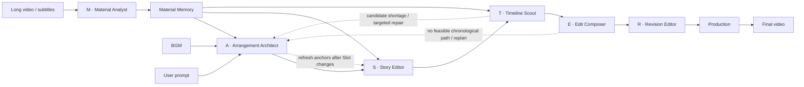

# CutMaster

English | [简体中文](README.md)

**CutMaster: Let the MASTER team edit.**

CutMaster is a multi-agent automatic editing framework for long-form video. It assigns material understanding, rhythmic arrangement, story anchoring, candidate retrieval, sequence composition, and final review to six specialized roles, balancing three editorial objectives in one workflow:

- **Narrative alignment**: key source dialogue anchors the story, characters, and prompt intent.
- **Emotional pacing**: the Slot structure follows musical sections, beats, accents, and energy.
- **Visual quality**: candidate validation, motion filtering, transition scoring, and global sequence search jointly control the final imagery.

> CutMaster employs a MASTER team of specialized agents that progressively transforms long-form footage into a narrative-aligned, emotionally paced, and visually coherent montage.

<p align="center">
  
</p>

<p align="center"><em>Starting from long-form footage and user intent, the MASTER team collaborates on material understanding, edit planning, sequence optimization, and final rendering.</em></p>

## The MASTER Editing Team

The complete CutMaster workflow is organized as a **MASTER** team:

| Letter | Agent | Code entry | Editorial responsibility |
|---|---|---|---|
| **M** | **Material Analyst** | `analyser/material_analyst.py` | Builds reusable material memory from Shots, Segments, dialogue, and story summaries |
| **A** | **Arrangement Architect** | `planners/arrangement_architect.py` | Profiles the BGM and arranges Slot duration, rhythm, emotional pacing, and narrative structure |
| **S** | **Story Editor** | `planners/story_editor.py` | Uses key source dialogue to anchor plot, character arcs, and prompt intent |
| **T** | **Timeline Scout** | `planners/timeline_scout.py` | Searches the source timeline and validates candidates for every Slot |
| **E** | **Edit Composer** | `planners/edit_composer.py` | Combines unary visual quality and pairwise transitions with Beam Search |
| **R** | **Revision Editor** | `planners/revision_editor.py` | Reviews the cut and replaces weak shots within the validated candidate pool |

In short:

```text
M       = Analyser
ASTER   = Planning team
M + ASTER = MASTER
```

`CutMaster` is the only complete-workflow entry point. `ASTERTeam` is the only coordinator for the five planning agents. Agents never call one another directly; the team orchestrator owns all forward collaboration and repair loops.

## Architecture



The executable call structure is:

```text
CLI
└── CutMaster
    ├── MaterialAnalystAgent
    ├── ASTERTeam
    │   ├── ArrangementArchitectAgent
    │   ├── StoryEditorAgent
    │   ├── TimelineScoutAgent
    │   ├── EditComposerAgent
    │   └── RevisionEditorAgent
    └── Production
        ├── source-window optimization
        ├── dialogue audio preparation
        └── frame-exact rendering
```

### Agent–tool boundary

- **Agents make editorial decisions**: they understand material, plan structure, select story anchors, construct the candidate space, compose the sequence, and review the script.
- **Tools provide capabilities**: ASR, caching, music analysis, media access, motion computation, visual scoring, and planning feedback live under `analyser/tools/` and `planners/tools/`.
- **Production executes the plan**: source-window optimization, vocal preparation, FFmpeg rendering, and audio mixing happen after planning. Production is not a seventh agent.
- **Shared infrastructure remains neutral**: configuration, contracts, prompt registration, and runtime capabilities live under `configuration/`, `contracts/`, `prompting/`, and `runtime/`.

## Core mechanisms

### 1. Reusable Material Memory

The Material Analyst performs full-source shot detection, per-Shot visual annotation, Segment aggregation, ASR, dialogue reconstruction, and story summarization. Results are cached under `.cutmaster/materials/` by source material and analysis configuration, so the same video can support different prompts and BGM tracks.

Material Memory is independent of any single edit plan, avoiding repeated full-video understanding on every run.

### 2. Music-aware Slot arrangement

The Arrangement Architect uses `planners/tools/music_analysis.py` to extract beats, accents, energy, and musical sections, then arranges the target duration into a sequence of Slots. Each Slot expresses:

- its time budget and rhythmic position;
- its narrative function and desired content;
- its emotional, shot-scale, and motion intent;
- its structural relation to neighboring Slots.

Slot Planning defines what the cut needs before deciding which exact shot should fill it.

### 3. Source dialogue as story anchors

The Story Editor selects a small number of high-value dialogue passages from Material Memory and binds them to their source-synchronous visuals. These anchors preserve essential plot points, character relations, and prompt intent within a visual montage.

Ordinary clips keep their source audio muted. Only selected Dialogue Anchors are prepared and mixed with the BGM, with automatic music ducking during speech.

### 4. Candidate space with closed-loop repair

The Timeline Scout searches the original timeline for non-anchor Slots and validates protagonist identity, relevance, visibility, and motion. If a Slot lacks viable candidates, the Scout returns explicit diagnostics to the Arrangement Architect for targeted repair. When Slot semantics change, the Story Editor revalidates the anchors.

### 5. Efficient global sequence composition

The Edit Composer considers:

- unary candidate fitness for each Slot;
- visual continuity and transition quality between adjacent shots;
- hard constraints such as strict source chronology.

Sequence selection uses Beam Search. VLM transition scores are computed lazily only for edges that can still survive in promising beams, retaining a global combination space while controlling inference cost. The default score is `0.60 × unary + 0.40 × pairwise`.

### 6. Candidate-constrained revision

The Revision Editor reviews the sequence and replaces weak shots only within the validated candidate pool. It never bypasses the Timeline Scout by inventing unverified clips. Production then adapts source windows, renders on a frame-exact timeline, prepares dialogue vocals, and produces the final video.

## Quick start

### Requirements

- Python `3.12`
- [uv](https://docs.astral.sh/uv/)
- FFmpeg and FFprobe
- LLM and VLM services with OpenAI-compatible APIs
- An API key for Bailian ASR

On macOS:

```bash
brew install ffmpeg uv
```

### Installation

```bash
git clone <repository-url>
cd CutMaster
uv sync
```

Copy the environment template:

```bash
cp .env.example .env
```

Then fill in:

```dotenv
DASHSCOPE_API_KEY=your_api_key

# Optional: authenticates Demucs model downloads
HF_TOKEN=
```

The CLI automatically loads `.env` next to `config.toml` without overriding variables already present in the process environment.

## Usage

### CLI

```bash
uv run cutmaster run \
  --video /path/to/source.mp4 \
  --audio /path/to/bgm.mp3 \
  --prompt "Create an energetic cut centered on the protagonist's growth and final victory" \
  --output-dir /path/to/output \
  --target-duration 60 \
  --target-shot-length 4 \
  --config config.toml \
  --overwrite
```

The module entry point is also available:

```bash
uv run python -m cutmaster run --help
```

Common optional arguments:

| Argument | Meaning |
|---|---|
| `--subtitle` | Reuse an existing subtitle file; otherwise run ASR |
| `--prompt-type` | Prompt category, defaults to `event` |
| `--video-title` | Source title supplied to material analysis |
| `--max-clip-duration` | Maximum duration for an individual candidate clip |
| `--overwrite` | Replace an existing output and start a fresh planning run |

### Python API

```python
from pathlib import Path

from cutmaster import CutMaster
from cutmaster.configuration.loader import load_config
from cutmaster.contracts.workflow import RunRequest

config = load_config(Path("config.toml"))
request = RunRequest(
    video_path=Path("/path/to/source.mp4"),
    audio_path=Path("/path/to/bgm.mp3"),
    prompt="Create an energetic cut centered on the protagonist's growth",
    output_dir=Path("/path/to/output"),
    target_output_length_sec=60,
    target_shot_length_sec=4,
    overwrite=True,
)

result = CutMaster(config).run(request)
print(result.output_video)
```

External integrations and benchmark adapters should use the public `from cutmaster import CutMaster` entry point rather than importing internal agents or tools.

## Configuration

The default configuration lives in [`config.toml`](config.toml) and follows the ownership boundaries of the architecture:

| Section | Owner | Main controls |
|---|---|---|
| `[llm]`, `[vlm]` | Runtime | Models, endpoints, timeouts, retries, and concurrency |
| `[asr]`, `[shot_detection]`, `[shot_annotation]` | Material Analyst | Subtitle generation, shot detection, and annotation |
| `[material_analysis]` | Material Analyst | Material Memory cache location |
| `[slot_planning]` | Arrangement Architect | Target clip duration and replan rounds |
| `[dialogue_anchors]` | Story Editor / Production | Anchor limits, vocal separation, and mixing |
| `[candidate_retrieval]` | Timeline Scout | Candidate count, retrieval rounds, and validation |
| `[beam_search]` | Edit Composer | Beam width |
| `[script_review]` | Revision Editor | Candidate-constrained review rounds |
| `[source_window_optimization]`, `[render]` | Production | Cut search, canvas, frame rate, encoding, and volume |

The default LLM/VLM request timeout is `600` seconds; the total wait for an asynchronous ASR task is `1800` seconds. Every field and default is documented inline in `config.toml`.

## Artifacts

Each run keeps auditable intermediate artifacts under `output_dir`:

| Artifact | Meaning |
|---|---|
| `output.mp4` | Final video |
| `montage.mp4` | Visual montage before final audio assembly |
| `result.json` | Final result, timings, and artifact paths |
| `source.srt`, `dialogue_merged.srt`, `dialogues.json` | Raw and reconstructed dialogue data |
| `music_profile.json` | Beat, energy, and musical-section profile |
| `edit_plan.json` | Slot arrangement from the Arrangement Architect |
| `dialogue_anchors.json` | Source-dialogue anchors selected by the Story Editor |
| `candidate_pool.json` | Candidate space built by the Timeline Scout |
| `selection_diagnostics.json` | Edit Composer path and scoring diagnostics |
| `script_raw.json`, `script_adapted.json` | Reviewed script and Production-adapted script |
| `planning_history.json`, `planning_calls.json` | Planning feedback history and model-call tree |
| `cutmaster.log` | Structured runtime log |

The material cache additionally stores `video_description.json`, `video_summary.json`, and `analysis_history.json` for cross-run reuse and analysis tracing.

## Source layout

```text
src/cutmaster/
├── cutmaster.py                     # complete-workflow entry point
├── analyser/
│   ├── material_analyst.py          # M
│   └── tools/                       # ASR, dialogue reconstruction, cache
├── planners/
│   ├── aster_team.py                # ASTER team orchestrator
│   ├── arrangement_architect.py     # A
│   ├── story_editor.py              # S
│   ├── timeline_scout.py            # T
│   ├── edit_composer.py             # E
│   ├── revision_editor.py           # R
│   └── tools/                       # music, retrieval, validation, scoring, feedback
├── production/                      # script adaptation, audio, frame-exact rendering
├── prompting/                       # prompts and response-contract registry
├── configuration/                   # configuration models and loading
├── contracts/                       # cross-stage data contracts
├── runtime/                         # model access, context, logging, media infrastructure
└── timecode.py                      # shared timecode types
```

See [`docs/architecture.md`](docs/architecture.md) for dependency rules and public APIs, and [`docs/adr/`](docs/adr/) for architecture decisions.

## Verification

```bash
uv run pytest
uv run cutmaster --help
uv run cutmaster run --help
```

## Current scope

- One long source video, one BGM track, and one natural-language prompt per run
- One landscape output video
- Strict source chronology
- Muted ordinary source audio, with only selected Dialogue Anchors preserved
- Bailian as the current ASR backend
- Remote LLM/VLM dependencies; runtime varies with source duration, candidate count, model concurrency, and vocal separation

## Attribution

CutMaster uses [PySceneDetect](https://www.scenedetect.com/) for shot detection, [librosa](https://librosa.org/) for music analysis, [Demucs](https://github.com/facebookresearch/demucs) for vocal separation, and [FFmpeg](https://ffmpeg.org/) for media rendering.
