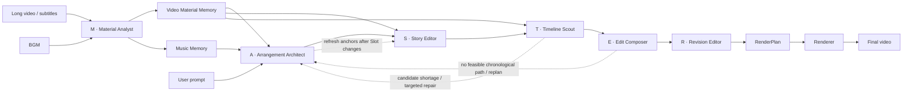

# CutMaster

English | [简体中文](README.md)

**CutMaster: Let the MASTER team edit.**

CutMaster is a multi-agent automatic editing framework for long-form video. It assigns material understanding, rhythmic arrangement, story anchoring, candidate retrieval, sequence composition, and final review to six specialized roles, balancing three editorial objectives in one workflow:

- **Narrative alignment**: key source dialogue anchors the story, characters, and prompt intent.
- **Emotional pacing**: the Slot structure follows musical sections, beats, accents, and energy.
- **Visual quality**: candidate validation, motion filtering, transition scoring, and global sequence search jointly control the final imagery.

> CutMaster employs a MASTER team of specialized agents that progressively transforms long-form footage into a narrative-aligned, emotionally paced, and visually coherent montage.

<p align="center">
  
</p>

<p align="center"><em>Starting from long-form footage and user intent, the MASTER team collaborates on material understanding, editorial decisions, sequence optimization, and final rendering.</em></p>

## The MASTER Editing Team

The complete CutMaster workflow is organized as a **MASTER** team:

| Letter | Agent | Code entry | Editorial responsibility |
|---|---|---|---|
| **M** | **Material Analyst** | `analyser/material_analyst.py` | Builds reusable memory for video Shots, Segments, dialogue, and story summaries, as well as complete music tracks |
| **A** | **Arrangement Architect** | `planners/arrangement_architect.py` | Projects Music Memory onto the target duration and arranges Slot duration, rhythm, emotional pacing, and narrative structure |
| **S** | **Story Editor** | `planners/story_editor.py` | Uses key source dialogue to anchor plot, character arcs, and prompt intent |
| **T** | **Timeline Scout** | `planners/timeline_scout.py` | Searches the source timeline and validates candidates for every Slot |
| **E** | **Edit Composer** | `planners/edit_composer.py` | Combines unary visual quality and pairwise transitions with Beam Search |
| **R** | **Revision Editor** | `planners/revision_editor.py` | Reviews the cut and replaces weak shots within the validated candidate pool |

In short:

```text
M       = Analyser
ASTER   = Planners team
M + ASTER = MASTER
```

`Orchestrator` is the complete-workflow entry point, while `Analyser`, `Planners`, and `Renderer` are independently callable. `ASTERTeam` remains the sole coordinator for the five editorial agents.

## Architecture



The executable call structure is:

```text
CLI
└── Orchestrator
    ├── Analyser
    │   └── MaterialAnalystAgent
    ├── Planners
    │   ├── ASTERTeam
    │   │   ├── ArrangementArchitectAgent
    │   │   ├── StoryEditorAgent
    │   │   ├── TimelineScoutAgent
    │   │   ├── EditComposerAgent
    │   │   └── RevisionEditorAgent
    │   └── plan compiler / source-window optimization
    └── Renderer
        ├── dialogue audio preparation
        └── frame-exact rendering
```

### Agent–tool boundary

- **Agents make editorial decisions**: they understand material, plan structure, select story anchors, construct the candidate space, compose the sequence, and review the script.
- **Tools provide capabilities**: ASR, the Material Library, complete-track music analysis, media access, Music Profile projection, motion computation, visual scoring, and ASTER coordination feedback live under `analyser/tools/` and `planners/tools/`.
- **The Planners stage finalizes the edit**: source-window optimization, beat adjustment, and output-frame allocation are frozen in an immutable `RenderPlan`.
- **Renderer executes the plan**: it prepares dialogue audio, renders, and mixes without accessing LLM/VLM services or mutating ASTER artifacts.
- **Shared infrastructure remains neutral**: configuration, contracts, prompt registration, and runtime capabilities live under `configuration/`, `contracts/`, `prompting/`, and `runtime/`.

## Core mechanisms

### 1. Material Library and reusable Material Memory

The Material Library stores read-only managed copies of video and music sources and uses a unique **Material Name** as each asset's public identity. When no name is supplied, the CLI uses the source filename stem as the candidate name. Within one Material type, adding the same SHA-256 bytes under the same candidate-name family reuses the existing Material and its completed analysis. Adding different bytes under the same family allocates `Name (2)`, `Name (3)`, and so on. Equal bytes explicitly submitted under different candidate names remain two independently selectable Materials.

SHA-256 is only an internal consistency check. It is not embedded in the Material Name and is not a CLI selector. If a managed source no longer matches its recorded fingerprint, the Material is blocked from analysis, edit decision, and rendering. The low-level Material Library supports adding and deleting sources, but deletion is not exposed through the CLI or frontend yet. In-place replacement is unsupported.

Completed Material Memory is reused directly. An interrupted video analysis can
resume only when its subtitle and analysis specification are unchanged, so
checkpoints from incompatible inputs are never mixed.

For video, the Material Analyst detects the complete PySceneDetect Shot partition and binds ASR dialogue to Shots. It applies the Scene-VLM context-focus pass, creates semantic Segments, produces ordered per-Shot annotations, and aggregates story summaries. For complete music tracks, it extracts tempo, beats, accents, energy, and musical sections. These outputs form Video Material Memory and Music Memory under `.cutmaster/materials/`, independently of any single editing request.

### 2. Music-aware Slot arrangement

Complete-track music analysis belongs to the Material Analyst in Analyser. The Planners stage does not decode and analyse the source track again. The Arrangement Architect projects reusable Music Memory onto the requested output duration—truncating or looping it as needed—to create a Music Profile specific to the current Planners invocation, then arranges that duration into a sequence of Slots. Each Slot expresses:

- its time budget and rhythmic position;
- its narrative function and desired content;
- its emotional, shot-scale, and motion intent;
- its structural relation to neighboring Slots.

Slot Arrangement defines what the cut needs before deciding which exact shot should fill it.

### 3. Source dialogue as story anchors

The Story Editor selects a small number of high-value dialogue passages from Material Memory and binds them to their source-synchronous visuals. These anchors preserve essential plot points, character relations, and prompt intent within a visual montage.

Ordinary clips keep their source audio muted. Only selected Dialogue Anchors are prepared and mixed with the BGM, with automatic music ducking during speech.

### 4. Candidate space with closed-loop repair

The Timeline Scout searches the original timeline for non-anchor Slots and validates protagonist identity, relevance, visibility, and motion. If a Slot lacks viable candidates, the Scout returns explicit diagnostics to the Arrangement Architect for targeted repair. When Slot semantics change, the Story Editor revalidates the anchors.

### 5. Efficient global sequence composition

The Edit Composer considers:

- unary candidate fitness for each Slot;
- visual continuity and transition quality between adjacent shots;
- hard constraints such as strict source chronology.

Sequence selection uses Beam Search. VLM transition scores are computed lazily only for edges that can still survive in promising beams, retaining a global combination space while controlling inference cost. The default score is `0.60 × unary + 0.40 × pairwise`.

### 6. Candidate-constrained revision

The Revision Editor reviews the sequence and replaces weak shots only within the validated candidate pool. The Planners stage then compiles a frame-exact `RenderPlan`; Renderer can reuse that plan for BGM-only and dialogue variants.

## Quick start

### Requirements

- Python `3.12`
- [uv](https://docs.astral.sh/uv/)
- FFmpeg and FFprobe
- LLM and VLM services with OpenAI-compatible APIs
- DeepSeek and Alibaba Cloud Model Studio API keys for the default configuration, or one Model Studio key for the all-DashScope option

On macOS:

```bash
brew install ffmpeg uv
```

### Installation

```bash
git clone <repository-url>
cd CutMaster
uv sync
```

Copy the environment template:

```bash
cp .env.example .env
```

The default configuration prioritizes cost: it uses DeepSeek for the text LLM and DashScope for the VLM and ASR, so fill in both API keys:

```dotenv
DEEPSEEK_API_KEY=your_deepseek_api_key
DASHSCOPE_API_KEY=your_dashscope_api_key

# Optional: authenticates Demucs model downloads
HF_TOKEN=
```

For a simpler setup, run the LLM, VLM, and ASR through DashScope: under `[llm]` in `config.toml`, comment out the default DeepSeek `model`, `base_url`, and `api_key_env`, then uncomment the adjacent three-line `qwen3.7-max` alternative. In that case, `.env` only needs:

```dotenv
DASHSCOPE_API_KEY=your_dashscope_api_key
```

The CLI automatically loads `.env` next to `config.toml` without overriding variables already present in the process environment.

## Usage

### CLI

```bash
uv run cutmaster run \
  --video /path/to/source.mp4 \
  --audio /path/to/bgm.mp3 \
  --prompt "Create an energetic cut centered on the protagonist's growth and final victory" \
  --output-dir /path/to/output \
  --target-duration 60 \
  --target-shot-length 4 \
  --audio-mode bgm_only \
  --config config.toml \
  --overwrite
```

The existing `run --video/--audio` form remains supported. Raw paths are first
added to the Material Library; their candidate Material Names default to the
filename stems and can be overridden with `--video-material-name` and
`--music-material-name`. The `analyse` commands report the final
`material_name`; a full run reports `video_material_name` and
`music_material_name`. Later calls can reuse completed analysis by selecting
those exact public names:

```bash
uv run cutmaster run \
  --video-material "feature-film" \
  --music-material "trailer-score" \
  --prompt "Create an energetic cut centered on the protagonist's growth and final victory" \
  --output-dir /path/to/output \
  --target-duration 60 \
  --config config.toml
```

`--video-material` and `--music-material` accept exact Material Names, not file
paths or SHA-256 values. The selected Materials must already have completed the
corresponding analysis.

The module entry point is also available:

```bash
uv run python -m cutmaster run --help
```

Common optional arguments:

| Argument | Meaning |
|---|---|
| `--subtitle` | Reuse an existing subtitle file; otherwise run ASR |
| `--prompt-type` | Prompt category, defaults to `event` |
| `--video-title` | Source title supplied to material analysis |
| `--material-name` | Candidate name used by `analyse` / `analyse-music`; defaults to the filename stem |
| `--video-material-name` | Candidate name used when `run` adds a raw video path |
| `--music-material-name` | Candidate name used when `plan` / `run` adds a raw music path |
| `--video-material`, `--music-material` | Select analysed video and music by exact Material Name |
| `--max-clip-duration` | Maximum duration for an individual candidate clip |
| `--audio-mode` | `bgm_only` or `dialogue` |
| `--overwrite` | Replace artifacts in the selected output directory; immutable ASTER Run history is not retained |

The three stages are also independently callable:

```bash
uv run cutmaster analyse \
  --video source.mp4 \
  --material-name "feature-film" \
  --output-dir artifacts/cutmaster/analyser

uv run cutmaster analyse-music \
  --audio bgm.mp3 \
  --material-name "trailer-score" \
  --output-dir artifacts/cutmaster/analyser/music

uv run cutmaster plan \
  --video-material "feature-film" \
  --music-material "trailer-score" \
  --prompt "..." \
  --output-dir artifacts/cutmaster/planners

uv run cutmaster render \
  --plan artifacts/cutmaster/planners/render_plan.json \
  --audio-mode dialogue \
  --output-dir artifacts/cutmaster/renderer
```

`plan` also accepts explicit analysis-result paths: `--analysis-result` for
video and `--music-analysis-result` for music. For compatibility, a raw track
may still be passed with `--audio`; Analyser then builds or reuses its Music
Memory before the Planners stage starts.

### Python API

```python
from pathlib import Path

from cutmaster import Orchestrator
from cutmaster.configuration.loader import load_config
from cutmaster.contracts.workflow import WorkflowRequest

config = load_config(Path("config.toml"))
request = WorkflowRequest(
    video_path=Path("/path/to/source.mp4"),
    audio_path=Path("/path/to/bgm.mp3"),
    prompt="Create an energetic cut centered on the protagonist's growth",
    output_dir=Path("/path/to/output"),
    target_output_length_sec=60,
    target_shot_length_sec=4,
    overwrite=True,
)

result = Orchestrator(config).run(request)
print(result.output_video)
```

External integrations should use `Orchestrator` for a full run or the public `Analyser`, `Planners`, and `Renderer` stage services.

## Configuration

The default configuration lives in [`config.toml`](config.toml) and follows the ownership boundaries of the architecture:

| Section | Owner | Main controls |
|---|---|---|
| `[llm]`, `[vlm]` | Runtime | Models, endpoints, timeouts, retries, concurrency, and input/cached-input/output prices |
| `[analyser.*]` | Analyser | Material Library, ASR, shot/scene annotation, complete-track music analysis, and material caching |
| `[planners.*]` | Planners | Arrangement, anchor, retrieval, Beam, review, and source-window controls |
| `[renderer]`, `[renderer.dialogue_audio]` | Renderer | Canvas, encoding, vocal separation, and mixing |

The default LLM/VLM request timeout is `600` seconds; the total wait for an asynchronous ASR task is `1800` seconds. Every field and default is documented inline in `config.toml`.

All model prices use CNY per million tokens. Every call snapshots the active prices in its usage artifact, so later configuration changes never reprice historical calls. Uncached input, cache-hit input, and output are charged separately; reasoning tokens are already part of output tokens and are not charged twice.

## Artifacts

Each run keeps auditable intermediate artifacts under `output_dir`:

| Artifact | Meaning |
|---|---|
| `result.json` | Final result, timings, and artifact paths |
| `model_usage.json` | Workflow token and cost totals for `current_run` and `cumulative`, grouped by task and model |
| `analyser/analysis_result.json` | Formal index of the selected Video Material Memory |
| `analyser/source.srt`, `dialogue_merged.srt`, `dialogues.json` | Source and reconstructed dialogue data |
| `analyser/music/music_analysis_result.json` | Formal index of the selected Music Memory |
| `analyser/music/music_memory.json` | Complete-track beats, accents, energy, and section analysis |
| `planners/planners_result.json` | Planners stage result and ASTER coordination summary |
| `planners/render_plan.json` | Immutable frame-exact handoff to Renderer |
| `planners/music_profile.json`, `edit_plan.json`, `dialogue_anchors.json`, `candidate_pool.json`, `script_raw.json` | Target-duration Music Profile and other ASTER artifacts |
| `planners/diagnostics/` | Beam diagnostics, ASTER repair history, and model-call traces |
| `planners/diagnostics/model_usage.json` | Per-call price snapshots and current/cumulative Planners usage |
| `renderer/montage.mp4` | Reusable silent visual montage |
| `renderer/output.mp4` | Final rendered video |
| `renderer/render_request.json`, `render_result.json` | Render request and result |
| `cutmaster.log` | Structured runtime log |

The Material Library manifest and managed source copies live under the configured `.cutmaster/materials/` root. Each video Material's analysis directory stores `video_description.json`, `video_summary.json`, and `analysis_history.json`; each music Material's analysis directory stores `music_memory.json`. CLI callers resolve these caches by Material Name and do not need to retain their internal paths.

Each Video Material analysis directory also stores `model_usage.json`. `current_run` contains only requests issued by the current process and is zero for a complete cache reuse; `cumulative` preserves token and cost totals across runs in that task directory. These statistics remain local CutMaster artifacts and do not need to be reported by a Benchmark Adapter.

## Source layout

```text
src/cutmaster/
├── orchestrator.py                  # complete three-stage entry point
├── analyser/
│   ├── analyser.py                  # public Analyser service
│   ├── material_analyst.py          # M
│   └── tools/                       # Material Library, ASR, dialogue reconstruction, video cache, complete-track music analysis
│       ├── scene_segmenter.py        # Scene-VLM semantic segmentation
│       └── ...
├── planners/
│   ├── planners.py                  # public Planners service
│   ├── aster_team.py                # ASTER team orchestrator
│   ├── arrangement_architect.py     # A
│   ├── story_editor.py              # S
│   ├── timeline_scout.py            # T
│   ├── edit_composer.py             # E
│   ├── revision_editor.py           # R
│   └── tools/                       # Music Profile projection, retrieval, validation, scoring, feedback
│       ├── plan_compiler.py         # frame timeline and RenderPlan compiler
│       ├── source_window_optimizer.py # source-window optimization
│       └── ...
├── renderer/                        # independent audio and frame-exact rendering
├── prompting/                       # prompts and response-contract registry
├── configuration/                   # configuration models and loading
├── contracts/                       # cross-stage data contracts
├── runtime/                         # model access, context, logging, media infrastructure
└── timecode.py                      # shared timecode types
```

See [`docs/architecture.md`](docs/architecture.md) for dependency rules and public APIs, and [`docs/adr/`](docs/adr/) for architecture decisions.

## Verification

```bash
uv run pytest
uv run cutmaster --help
uv run cutmaster run --help
```

## Current scope

- One long source video, one BGM track, and one natural-language prompt per run
- One landscape output video
- Strict source chronology
- Muted ordinary source audio, with only selected Dialogue Anchors preserved
- Bailian as the current ASR backend
- Remote LLM/VLM dependencies; runtime varies with source duration, candidate count, model concurrency, and vocal separation

## Attribution

CutMaster uses [PySceneDetect](https://www.scenedetect.com/) for shot detection, [librosa](https://librosa.org/) for music analysis, [Demucs](https://github.com/facebookresearch/demucs) for vocal separation, and [FFmpeg](https://ffmpeg.org/) for media rendering.
