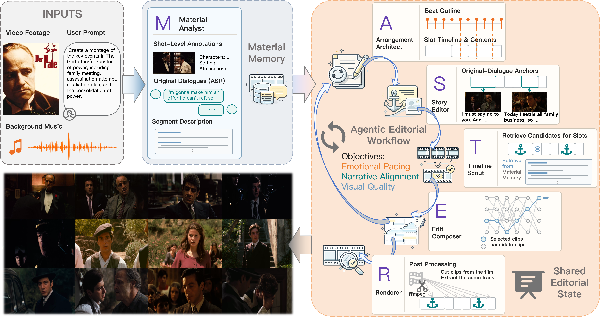
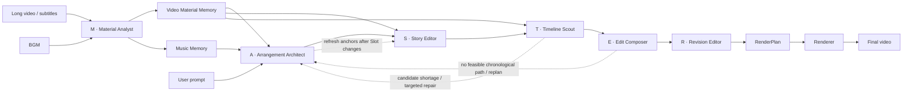
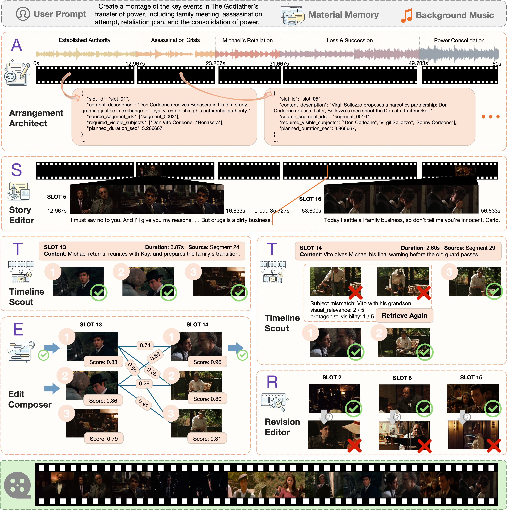

# CutMaster

English | [简体中文](README.md)

**CutMaster: Let the MASTER team edit.**

CutMaster is a multi-agent automatic editing framework for long-form video. It assigns material understanding, rhythmic arrangement, story anchoring, candidate retrieval, sequence composition, and final review to six specialized roles, balancing three editorial objectives in one workflow:

- **Narrative alignment**: key source dialogue anchors the story, characters, and prompt intent.
- **Emotional pacing**: the Slot structure follows musical sections, beats, accents, and energy.
- **Visual quality**: candidate validation, motion filtering, transition scoring, and global sequence search jointly control the final imagery.

> CutMaster employs a MASTER team of specialized agents that progressively transforms long-form footage into a narrative-aligned, emotionally paced, and visually coherent montage.

<p align="center">
  
</p>

<p align="center"><em>Starting from long-form footage and user intent, the MASTER team collaborates on material understanding, editorial decisions, sequence optimization, and final rendering.</em></p>

## The MASTER Editing Team

The complete CutMaster workflow is organized as a **MASTER** team:

| Letter | Agent | Code entry | Editorial responsibility |
|---|---|---|---|
| **M** | **Material Analyst** | `workflow/analyser/material_analyst.py` | Builds reusable memory for video Shots, Segments, dialogue, and story summaries, as well as complete music tracks |
| **A** | **Arrangement Architect** | `workflow/planners/arrangement_architect.py` | Projects Music Memory onto the target duration and arranges Slot duration, rhythm, emotional pacing, and narrative structure |
| **S** | **Story Editor** | `workflow/planners/story_editor.py` | Uses key source dialogue to anchor plot, character arcs, and prompt intent |
| **T** | **Timeline Scout** | `workflow/planners/timeline_scout.py` | Searches the source timeline and validates candidates for every Slot |
| **E** | **Edit Composer** | `workflow/planners/edit_composer.py` | Combines unary visual quality and pairwise transitions with Beam Search |
| **R** | **Revision Editor** | `workflow/planners/revision_editor.py` | Reviews the cut and replaces weak shots within the validated candidate pool |

In short:

```text
M       = Analyser
ASTER   = Planners team
M + ASTER = MASTER
```

CLI, FastAPI Web, Worker, and the Benchmark Adapter are peer inbound adapters.
CLI and Benchmark invoke synchronous complete workflows through
`CutMasterApplication.workflows`; Web maps HTTP/SSE to grouped Application use
cases; Worker executes Application-owned durable Jobs. The Application Layer
owns the managed Material, Project, Run, Frozen Edit, Render Variant, and Job
lifecycles. `ASTERTeam` remains the sole coordinator for the five editorial
agents: agents never call one another directly, and the team coordinator owns
all forward collaboration and repair feedback.

## Architecture

> The backend now implements `CutMasterApplication`, a Managed Workflow
> Coordinator, Material/Run/Render executors, a durable Job executor,
> SQLite-managed state, handle-only v2 Workflow contracts, and the Managed
> Artifact Manifest. CLI and Mashup-Benchmark now create Web-visible managed
> Project, Run, Frozen Edit, and Render Variant history.
> The FastAPI + React/Vite local Web workspace is now implemented alongside
> the backend foundations. CLI, FastAPI Web, Worker, and Mashup-Benchmark all
> enter through the Application Layer. Web `Start editing` now submits real
> ASTER planning to an isolated Worker process and persists its RenderPlan,
> initial Frozen Edit, and the
> required Candidate Bundle. The Web workspace also implements
> Material import, analysis, previews, and recovery; ASTER Run retry, boundary
> resume, run-again, deletion, and usage; Frozen Edit Review and atomic Guided
> Revision; and strict Render-Specification-driven Renderer, Dialogue Preview,
> Render Variant, and Outputs flows. One local supervisor provides FIFO,
> capacity limits, per-owner serialization, and orphan recovery, while durable
> SSE supports `Last-Event-ID` replay and full resynchronization. Provider/Setup
> connection tests, atomic local configuration writes, and guarded Data Root
> Migration are connected to the real backend as well.



The executable call structure is:

```text
CLI Adapter -----------> CutMasterApplication.workflows
Benchmark Adapter -----> CutMasterApplication.workflows
FastAPI Web Adapter ---> CutMasterApplication grouped use cases
Worker Adapter --------> ManagedJobExecutor
                                   │
                                   └── Application Layer
                                       ├── ManagedWorkflowCoordinator
                                       ├── ManagedMaterialAnalysisExecutor
                                       │   └── Analyser → MaterialAnalystAgent
                                       ├── RunPlanningExecutor
                                       │   └── Planners → ASTERTeam → A/S/T/E/R
                                       └── ManagedRenderExecutor → Renderer
```

Each adapter translates only its own protocol: CLI owns arguments, terminal
output, and exit codes; FastAPI owns HTTP and SSE; Worker owns the process entry
for one durable Job; Benchmark owns evaluation-task translation and submission
copy export. Adapters do not invoke one another or directly construct agents,
tools, repositories, or output directories.

### Agent–tool boundary

- **Agents make editorial decisions**: they understand material, plan structure, select story anchors, construct the candidate space, compose the sequence, and review the script.
- **Tools provide capabilities**: ASR, complete-track music analysis, media access, Music Profile projection, motion computation, visual scoring, and ASTER coordination feedback live under `workflow/analyser/tools/` and `workflow/planners/tools/`; Material lifecycle belongs to `app.materials`.
- **The Planners stage finalizes the edit**: source-window optimization, beat adjustment, and output-frame allocation are frozen in an immutable `RenderPlan`.
- **Renderer executes the plan**: it prepares dialogue audio, renders, and mixes without accessing LLM/VLM services or mutating ASTER artifacts.
- **Layer boundaries stay explicit**: configuration, managed Application contracts, stage contracts, Workflow prompting, and concrete infrastructure live under `configuration/`, `application/workflow/`, `workflow/contracts/`, `workflow/prompting/`, and `infrastructure/`.

## Core mechanisms

### 1. Material Library and reusable Material Memory

The Material Library stores read-only managed copies of video and music sources. Every Material owns an opaque internal **Material ID**, while users and CLI callers select it by `(Material Type, exact Material Name)`. The CLI defaults the name to the source filename stem. Names are unique within a Material Type: `app.materials.add()` reports every occupied name, and CutMaster never appends `(2)`, overwrites, or replaces a Material automatically. The `app.materials.ensure()` operation used by `analyse` and `run --video/--audio` gives CLI and automation idempotence only when type, name, and fingerprint all match, returning the same Material ID; the same name with different bytes is still a collision. Equal bytes under different available names remain independently selectable Materials.

SHA-256 is stored on the Material manifest record solely as an internal consistency check. It does not participate in the Material ID or directory name and is not a CLI selector. If a managed source no longer matches its recorded fingerprint, the Material is blocked from analysis, edit decision, and rendering. The Web Material Library exposes permanent deletion guarded by references and active Attempts; the CLI remains focused on add, ensure, and exact-name reuse. In-place replacement is unsupported.

Completed Material Memory is reused directly. An interrupted video analysis can
resume only when its subtitle and analysis specification are unchanged, so
checkpoints from incompatible inputs are never mixed.

For video, the Material Analyst detects the complete PySceneDetect Shot partition and binds ASR dialogue to Shots. It applies the Scene-VLM context-focus pass, creates semantic Segments, produces ordered per-Shot annotations, and aggregates story summaries. For complete music tracks, it extracts tempo, beats, accents, energy, and musical sections. These outputs form Video Material Memory and Music Memory under `.cutmaster/media/<type>/mat_<uuid>/analysis/`, independently of any single editing request.

### 2. Music-aware Slot arrangement

Complete-track music analysis belongs to the Material Analyst in Analyser. The Planners stage does not decode and analyse the source track again. The Arrangement Architect projects reusable Music Memory onto the requested output duration—truncating or looping it as needed—to create a Music Profile specific to the current Planners invocation, then arranges that duration into a sequence of Slots. Each Slot expresses:

- its time budget and rhythmic position;
- its narrative function and desired content;
- its emotional, shot-scale, and motion intent;
- its structural relation to neighboring Slots.

Slot Arrangement defines what the cut needs before deciding which exact shot should fill it.

### 3. Source dialogue as story anchors

The Story Editor selects a small number of high-value dialogue passages from Material Memory and binds them to their source-synchronous visuals. These anchors preserve essential plot points, character relations, and prompt intent within a visual montage.

Ordinary clips keep their source audio muted. Only selected Dialogue Anchors are prepared and mixed with the BGM, with automatic music ducking during speech.

### 4. Candidate space with closed-loop repair

The Timeline Scout searches the original timeline for non-anchor Slots and validates protagonist identity, relevance, visibility, and motion. After exhausting the assigned Segment, it expands only once to the previous, current, and next Segments, retrieves three times the remaining candidate deficit, and keeps the highest-scoring alternatives. Alternative windows may overlap or shift slightly; only exact timestamp duplicates are rejected. If a Slot still lacks viable candidates, the Scout returns explicit diagnostics to the Arrangement Architect for targeted repair. When Slot semantics change, the Story Editor revalidates the anchors.

### 5. Efficient global sequence composition

The Edit Composer considers:

- unary candidate fitness for each Slot;
- visual continuity and transition quality between adjacent shots;
- hard constraints such as strict source chronology.

Sequence selection uses Beam Search. VLM transition scores are computed lazily only for edges that can still survive in promising beams, retaining a global combination space while controlling inference cost. The default score is `0.60 × unary + 0.40 × pairwise`.

### 6. Candidate-constrained revision

The Revision Editor reviews the sequence and replaces weak shots only within the validated candidate pool. The Planners stage then compiles a frame-exact `RenderPlan`; Renderer can reuse that plan for BGM-only and dialogue variants.

## Case Study: Power Transfer in *The Godfather*

This example follows the prompt “Create a montage of the key events in *The Godfather*’s transfer of power, including the family meeting, assassination attempt, retaliation plan, and consolidation of power.” Material Memory supplies searchable story and visual context for the full film, while the background music defines the rhythmic backbone of the 60-second edit.

<p align="center">
  <a href="assets/case-study-the-godfather.png">
    
  </a>
</p>

<p align="center"><em>Starting from the prompt and Material Memory, the ASTER team arranges, anchors, retrieves, composes, and revises a 60-second timeline of the Corleone power transfer. Click the image for the full-size view.</em></p>

- **Arrangement Architect** maps the music into five acts—Established Authority, Assassination Crisis, Michael’s Retaliation, Loss & Succession, and Power Consolidation—and fixes each Slot’s content, source scope, visible subjects, and duration constraints.
- **Story Editor** anchors decisive plot turns with source dialogue and lets longer lines continue across adjacent visual Slots through L-cuts.
- **Timeline Scout** validates several candidates for ordinary Slots, rejecting and retrieving again when identity, visual relevance, or protagonist visibility is insufficient.
- **Edit Composer** combines unary shot scores with pairwise compatibility and searches the candidate graph for a globally coherent chronological path.
- **Revision Editor** reviews weak shots and replaces them within the validated candidate pool, producing a final montage that preserves source chronology, narrative coverage, and musical pacing.

## Quick start

### Requirements

- Python `3.12`
- [uv](https://docs.astral.sh/uv/)
- FFmpeg and FFprobe
- LLM and VLM services with OpenAI-compatible APIs
- DeepSeek and Alibaba Cloud Model Studio API keys for the default configuration, or one Model Studio key for the all-DashScope option

On macOS:

```bash
brew install ffmpeg uv
```

### Installation

```bash
git clone <repository-url>
cd CutMaster
uv sync
```

Copy the environment template:

```bash
cp .env.example .env
```

The default configuration prioritizes cost: it uses DeepSeek for the text LLM and DashScope for the VLM and ASR, so fill in both API keys:

```dotenv
DEEPSEEK_API_KEY=your_deepseek_api_key
DASHSCOPE_API_KEY=your_dashscope_api_key

# Optional: authenticates Demucs model downloads
HF_TOKEN=
```

The default configuration runs LLM, VLM, and ASR through DashScope, so `.env` only needs:

```dotenv
DASHSCOPE_API_KEY=your_dashscope_api_key
```

The CLI automatically loads `.env` next to `config.toml` without overriding variables already present in the process environment.

## Usage

### Local Web workspace

Build the client and start the local application:

```bash
npm --prefix web ci
npm --prefix web run build
uv run cutmaster serve --config config.toml
```

CutMaster opens at `http://127.0.0.1:8000` by default. The Web workspace uses
real Application data for Projects, the Material Library, Video/Music Memory
Explorer, Activity, and Settings. Materials can be preflighted and imported in
the browser (with an optional SRT for video), then queued for the real Analyser.
Failed or interrupted work supports Retry/Resume, active work supports Stop,
and deletion is guarded by references and running state. Dedicated,
annotation-free video JPEG covers and bar-style music energy previews are
bounded assets rather than full source media embedded in list responses.

A Project has **Project Setup**, **Runs**, and **Outputs** tabs. After saving
Materials, Editing Intent, and Target Duration, **Start editing** creates an
immutable ASTER Run and an isolated local subprocess executes the real
Planners call. Failed Runs support Retry; Interrupted Runs resume only from a
validated complete A/S/T/E/R agent boundary, including the replan-pending
boundary; successful Runs support Run again, and historical Runs can be
deleted when safe. Run detail and Activity show the same durable progress and
model-usage projection.

Opening a Frozen Edit loads the real Review workspace. Every Frozen Edit must
reference a complete, integrity-checked Candidate Bundle, enabling atomic,
candidate-constrained Guided Revision. A missing or damaged bundle—or an
incomplete selected-candidate mapping—returns `review_artifact_unavailable`;
there is no read-only fallback. A strict immutable
Render Specification drives real Renderer Attempts, automatic Dialogue
Preview, BGM-only Variants, playback, Range downloads, Finder reveal,
integrity verification, Render again, and guarded deletion. One
`LocalJobSupervisor` provides FIFO, capacity, per-owner serialization, and
orphan recovery across Analyser, Planners, and Renderer. A single global SSE
connection replays durable events using `Last-Event-ID` and falls back to REST
after `resync_required`.

Settings and first-run Setup support provider presets or custom
OpenAI-compatible connections, per-capability connection tests, atomic `.env`
and `config.toml` writes, and guarded Data Root Migration. Deliberately deferred
work includes persistent in-app notifications, an Activity log drawer,
generated OpenAPI TypeScript drift checks in CI,
multi-user/cloud deployment, and broader provider/media port injection.

### CLI

```bash
uv run cutmaster run \
  --video /path/to/source.mp4 \
  --audio /path/to/bgm.mp3 \
  --prompt "Create an energetic cut centered on the protagonist's growth and final victory" \
  --project-name "Protagonist Growth Montage" \
  --target-duration 60 \
  --target-shot-length 4 \
  --audio-mode bgm_only \
  --config config.toml
```

CLI no longer accepts `--output-dir`. It creates the same Material, Edit
Project, ASTER Run, Execution Attempt, Frozen Edit, and Render Variant records
as Web. Canonical artifacts stay under the active Application Data Root and are
immediately visible in the Web workspace.

The existing `run --video/--audio` form remains supported. For raw paths,
CutMaster first ensures that the corresponding Materials exist. Names default
to the filename stems and can be overridden with `--video-material-name` and
`--music-material-name`; they are never changed automatically, and an occupied
name bound to different bytes raises a collision. The `analyse` commands report
the validated `material_name`; a full run reports `video_material_name` and
`music_material_name`. Later calls can reuse completed analysis by selecting
those exact public names:

```bash
uv run cutmaster run \
  --video-material "feature-film" \
  --music-material "trailer-score" \
  --prompt "Create an energetic cut centered on the protagonist's growth and final victory" \
  --project-name "Material Reuse Example" \
  --target-duration 60 \
  --config config.toml
```

`--video-material` and `--music-material` accept exact Material Names, not file
paths or SHA-256 values. The selected Materials must already have completed the
corresponding analysis.

The module entry point is also available:

```bash
uv run python -m cutmaster run --help
```

Common optional arguments:

| Argument | Meaning |
|---|---|
| `--subtitle` | Reuse an existing subtitle file; otherwise run ASR |
| `--prompt-type` | Prompt category, defaults to `event` |
| `--video-title` | Source title supplied to material analysis |
| `--material-name` | Candidate name used by `analyse` / `analyse-music`; defaults to the filename stem |
| `--video-material-name` | Candidate name used when `run` adds a raw video path |
| `--music-material-name` | Candidate name used when `run` adds a raw music path |
| `--video-material`, `--music-material` | Select analysed video and music by exact Material Name |
| `--project-name` | Name of the Web-visible Edit Project created by the command |
| `--max-clip-duration` | Maximum duration for an individual candidate clip |
| `--audio-mode` | `bgm_only` or `dialogue` |

The three stages are also independently callable:

```bash
uv run cutmaster analyse \
  --video source.mp4 \
  --material-name "feature-film"

uv run cutmaster analyse-music \
  --audio bgm.mp3 \
  --material-name "trailer-score"

uv run cutmaster plan \
  --video-material "feature-film" \
  --music-material "trailer-score" \
  --prompt "..." \
  --project-name "Planning Only Example"

uv run cutmaster render \
  --edit-id edit_00000000-0000-4000-8000-000000000000 \
  --audio-mode dialogue
```

`plan` accepts only exact names of analysed Materials in the Material Library;
`render` accepts a Web-visible Frozen Edit ID. Component commands therefore do
not create directories detached from product history.

### Python API

```python
from pathlib import Path

from cutmaster import CutMasterApplication
from cutmaster.application.workflow import ExecuteManagedWorkflowCommand

app = CutMasterApplication.open(Path("config.toml"))
request = ExecuteManagedWorkflowCommand(
    prompt="Create an energetic cut centered on the protagonist's growth",
    video_path=Path("/path/to/source.mp4"),
    audio_path=Path("/path/to/bgm.mp3"),
    project_name="Protagonist Growth Montage",
    target_output_length_sec=60,
    target_shot_length_sec=4,
    audio_mode="bgm_only",
)

result = app.workflows.execute_and_wait(request)
print(result.project_id, result.render_variant_id)
```

CLI and Benchmark invoke `CutMasterApplication.workflows`; FastAPI Web and
Worker connect to the same Application's grouped use cases and durable Job
executor respectively. The four adapters never invoke one another or bypass
the Application Layer to reach internal agents or tools.

## Configuration

The default configuration lives in [`config.toml`](config.toml). It is the only
non-secret configuration file shared by CLI, Benchmark, WebUI, and managed
workers; Settings updates it atomically and no additional local TOML is created
or merged. API keys remain exclusively in `.env` or the process environment.
The file follows the ownership boundaries of the architecture:

| Section | Owner | Main controls |
|---|---|---|
| `[llm]`, `[vlm]` | Infrastructure / Workflow | Models, endpoints, timeouts, retries, concurrency, and input/cached-input/output prices |
| `[analyser.*]` | Analyser | ASR, shot/scene annotation, complete-track music analysis, and Material Memory reuse |
| `[planners.*]` | Planners | Arrangement, anchor, retrieval, Beam, review, and source-window controls |
| `[renderer]`, `[renderer.dialogue_audio]` | Renderer | Canvas, encoding, vocal separation, and mixing |

The default LLM/VLM request timeout is `600` seconds; the total wait for an asynchronous ASR task is `600` seconds. Every field and default is documented inline in `config.toml`.

All model prices use CNY per million tokens. Every call snapshots the active prices in its usage artifact, so later configuration changes never reprice historical calls. Uncached input, cache-hit input, and output are charged separately; reasoning tokens are already part of output tokens and are not charged twice.

## Artifacts

CLI, Benchmark, and Web share the canonical managed layout below; complete
executions no longer create an authoritative caller-selected `output_dir`:

| Managed path | Meaning |
|---|---|
| `media/<type>/mat_<uuid>/analysis/` | Reusable Video or Music Material Memory |
| `projects/project_<uuid>/runs/run_<uuid>/plan.json` | Frame-exact RenderPlan owned by the Frozen Edit |
| `projects/project_<uuid>/runs/run_<uuid>/review_bundle.json` | Candidate Bundle integrity manifest |
| `projects/project_<uuid>/runs/run_<uuid>/model_usage.json` | Token and cost totals for the ASTER Run |
| `projects/project_<uuid>/runs/run_<uuid>/result.json` | Managed CLI/Benchmark receipt and relative artifact manifest |
| `projects/project_<uuid>/renders/render_<uuid>/master.mp4` | Canonical Render Variant master shared by Web, CLI, and Benchmark |

After completion, Mashup-Benchmark validates the Data-Root-relative receipt and
copies evaluation artifacts into
`runs/<run_id>/task_outputs/<task_id>/`. Those are submission copies; the
CutMaster Project and Render Variant remain authoritative.

The Application Layer always derives `.cutmaster/media/` from the active Application Data Root; the Material Library no longer has an independent storage root:

```text
.cutmaster/media/
├── manifest.json
├── video/mat_<uuid>/
│   ├── source.<ext>
│   └── analysis/
└── music/mat_<uuid>/
    ├── source.<ext>
    └── analysis/
```

Each manifest record binds Material ID, Type, Name, SHA-256, and source/analysis relative paths; Name and SHA-256 never participate in path construction. A video Material's `analysis/` directory stores `video_description.json`, `video_summary.json`, and `analysis_history.json`; a music Material's `analysis/` directory stores `music_memory.json`. CLI callers resolve the manifest by Material Name, after which the internal Material ID locates storage; callers retain neither paths nor IDs. The existing `.cutmaster/materials-backup/` is a historical backup that CutMaster never scans, imports, migrates, or modifies.

Each Video Material analysis directory also stores `model_usage.json`. `current_run` contains only requests issued by the current process and is zero for a complete cache reuse; `cumulative` preserves token and cost totals across runs in that task directory. These statistics remain local CutMaster artifacts and do not need to be reported by a Benchmark Adapter.

## Source layout

```text
src/cutmaster/
├── bootstrap/                       # outermost local Web + Worker composition
├── application/                     # Composition Root and managed use cases
│   ├── workflow/                    # Coordinator, contracts, durable Job executor
│   ├── materials/                   # Material lifecycle and Analysis executor
│   ├── projects/                    # Edit Project and Creative Brief
│   ├── runs/                        # ASTER Run and Planning executor
│   ├── renders/                     # Render Variant and Render executor
│   ├── jobs/                        # Attempts, Jobs, events, and recovery
│   ├── settings/                    # Effective Configuration and Data Root
│   └── ports/                       # Inward-facing Application ports
├── domain/                          # pure domain values and state
├── workflow/
│   ├── analyser/                       # M + tools
│   ├── planners/                       # ASTER Team + tools
│   ├── renderer/                       # frame-exact rendering
│   ├── contracts/                      # handle-only v2
│   ├── prompting/
│   └── shared/
├── adapters/                        # peer CLI, Web, and Worker process adapters
├── infrastructure/                  # SQLite, Material Catalog, models, media, logging
└── configuration/                   # Effective Configuration
```

The Mashup-Benchmark Adapter remains in the separate Benchmark repository. It
is a peer of CLI, Web, and Worker, invokes the public
`cutmaster.application.workflow` contract, and copies only the managed
artifacts required for evaluation into the Benchmark Run directory after
completion.

See [`docs/architecture.md`](docs/architecture.md) for dependency rules and public APIs, and [`docs/adr/`](docs/adr/) for architecture decisions.

## Verification

```bash
uv run pytest
uv run cutmaster --help
uv run cutmaster run --help
npm --prefix web run typecheck
npm --prefix web run lint
npm --prefix web test
npm --prefix web run build
```

## Current scope

- One long source video, one BGM track, and one natural-language prompt per run
- One landscape output video
- Strict source chronology
- Muted ordinary source audio, with only selected Dialogue Anchors preserved
- Bailian as the current ASR backend
- Remote LLM/VLM dependencies; runtime varies with source duration, candidate count, model concurrency, and vocal separation

## Attribution

CutMaster uses [PySceneDetect](https://www.scenedetect.com/) for shot detection, [librosa](https://librosa.org/) for music analysis, [Demucs](https://github.com/facebookresearch/demucs) for vocal separation, and [FFmpeg](https://ffmpeg.org/) for media rendering.
