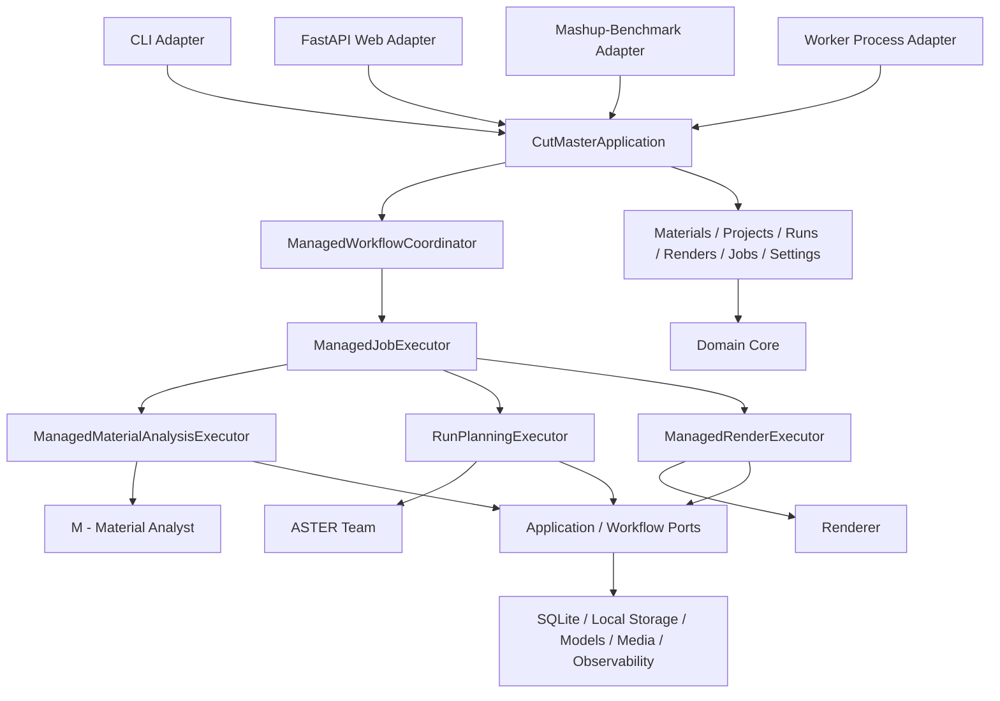

# CutMaster architecture

The current backend has three independently callable, handle-only Workflow
stages behind a framework-independent Application Layer. CLI, the FastAPI Web
adapter, the Worker process adapter, and Mashup-Benchmark are peer inbound
adapters. They call `CutMasterApplication.workflows` or another grouped
Application service; no adapter calls another adapter. Complete synchronous
execution is coordinated by `ManagedWorkflowCoordinator`, while durable work is
performed by Application-owned Material, Run, Render, and Job executors.



The adapters translate protocols only. The Application owns lifecycle and
orchestration, Workflow owns editing intelligence, Domain owns product state,
and Infrastructure implements inward-facing ports.

## Implemented backend layout

```text
cutmaster/
├── application/                    # composition and real use cases
│   ├── workflow/                       # managed contracts and coordinator
│   ├── materials/
│   ├── projects/
│   ├── runs/
│   ├── renders/
│   ├── jobs/
│   ├── settings/
│   └── ports/
├── domain/                         # pure product values and state
├── workflow/
│   ├── analyser/                      # Material Analyst + tools
│   ├── planners/                      # ASTER Team + tools
│   ├── renderer/
│   ├── contracts/                     # handle-only v2 contracts
│   ├── ports/
│   ├── prompting/
│   └── shared/
├── bootstrap/                         # outermost peer-adapter composition
│   ├── __init__.py
│   └── local_web.py                   # wires FastAPI + local Worker supervisor
│
├── adapters/
│   ├── cli/
│   ├── web/
│   └── worker/                         # one durable Job per process
├── infrastructure/
│   ├── persistence/sqlite/            # managed state and events
│   ├── storage/local/                 # Material Catalog
│   ├── media/
│   ├── models/
│   └── observability/
└── configuration/                  # Effective Configuration
```

The root package still re-exports `Analyser`, `Planners`, and `Renderer`, but
their implementations live only under `workflow/`. `__main__.py` and the
installed `cutmaster` script both delegate to `adapters.cli.main`. Managed
commands and receipts live in `application.workflow`; the earlier root workflow
facade, root CLI module, raw-path stage contracts, caller-owned output API, and
generic `runtime/` package are absent.

## Repository layout and Web expansion

**Status:** the Python backend, peer CLI/Web/Worker adapters, React/Vite client,
SPA packaging, Application-owned managed execution, local Job Supervisor,
durable SSE, guarded Data Root Migration, Frozen Edit Review, and atomic Guided
Revision are implemented. Some leaf files in the fuller map below remain a
design map; consolidated modules need not be split merely to match every
proposed filename.

CutMaster remains a standard Python `src`-layout repository. The backend is not
wrapped in another `backend/` directory, and the React client lives in the
root-level `web/` directory rather than inside the Python package. The
Application Layer refactor groups the three existing stage implementations under
one `workflow/` boundary. `workflow` is the canonical package name because it
corresponds to the domain term CutMaster Workflow; an additional `core/` or
per-stage `services/` wrapper would add no useful boundary.

## Portable Material Memory

Material Memory is location-independent. Persisted video, music, dialogue,
analysis-receipt, and frame-manifest documents contain no absolute paths or
serialized runtime handles. The Application binds their Material IDs and
fingerprints to the active Data Root and constructs runtime paths only while a
Material lease is held. Segment clips and scene frames are resolved from safe
identifiers inside their owning Material directory. Only the current schema is
accepted; runtime compatibility readers for older persisted contracts do not
exist. See [ADR 0023](adr/0023-use-portable-material-memory-contracts.md).

### Repository root

```text
CutMaster/
├── .github/
│   └── workflows/
│       ├── ci.yml
│       └── package.yml
├── docs/
│   ├── adr/
│   ├── assets/
│   │   └── framework.png
│   ├── design/
│   │   └── master-editing-team.md
│   ├── architecture.md
│   ├── frontend-design.md
│   ├── logging.md
│   └── prompting.md
├── src/
│   └── cutmaster/
├── tests/
├── web/                              # React/Vite client
├── .env.example
├── .gitignore
├── .python-version
├── CONTEXT.md
├── LICENSE
├── README.md
├── README_EN.md
├── THIRD_PARTY_NOTICES.md
├── config.toml
├── hatch_build.py                    # SPA packaging hook
├── pyproject.toml
└── uv.lock
```

`CONTEXT.md`, packaging metadata, legal files, the authoritative Application
configuration, and its environment template stay at the root. Documentation
images live under `docs/assets/`; they are not Web assets or runtime package
resources. Mashup-Benchmark remains a separate peer-adapter repository and is
never vendored, symlinked, or collected as part of CutMaster's tests.

### Complete Web-release Python package map

The tree below records the accepted Web-release ownership map. The implemented
backend currently uses the consolidated package structure shown at the start of
this document. The Web adapter, front-end-serving infrastructure, shared local
supervisor, Analyser/Planners/Renderer workers, and durable SSE transport are
present. Persistent notifications and several later product leaves remain
design-map entries rather than implemented modules.

```text
src/cutmaster/
├── __init__.py                         # lazy public exports
├── __main__.py                         # delegates to adapters.cli.main
├── domain/
│   ├── __init__.py
│   ├── ids.py
│   ├── errors.py
│   ├── artifacts.py
│   ├── materials.py
│   ├── projects.py
│   ├── runs.py
│   ├── edits.py
│   ├── renders.py
│   ├── attempts.py
│   ├── events.py
│   └── notifications.py
│
├── application/
│   ├── __init__.py
│   ├── cutmaster.py                    # CutMasterApplication composition root
│   ├── errors.py
│   ├── workflow/
│   │   ├── __init__.py
│   │   ├── contracts.py              # public managed commands and receipts
│   │   ├── coordinator.py            # complete managed lifecycle
│   │   ├── job_execution.py          # unified durable Job executor facade
│   │   ├── material_job.py           # Material Analysis Job state machine
│   │   ├── run_job.py                # ASTER Run Job state machine
│   │   └── render_job.py             # Renderer Job state machine
│   ├── materials/
│   │   ├── __init__.py
│   │   ├── commands.py
│   │   ├── queries.py
│   │   ├── execution.py             # Material Analysis executor
│   │   ├── views.py
│   │   └── service.py
│   ├── projects/
│   │   ├── __init__.py
│   │   ├── commands.py
│   │   ├── queries.py
│   │   ├── views.py
│   │   └── service.py
│   ├── runs/
│   │   ├── __init__.py
│   │   ├── commands.py
│   │   ├── queries.py
│   │   ├── execution.py
│   │   ├── revisions.py
│   │   ├── views.py
│   │   └── service.py
│   ├── renders/
│   │   ├── __init__.py
│   │   ├── commands.py
│   │   ├── queries.py
│   │   ├── specifications.py
│   │   ├── integrity.py
│   │   ├── execution.py
│   │   ├── views.py
│   │   └── service.py
│   ├── jobs/
│   │   ├── __init__.py
│   │   ├── commands.py
│   │   ├── queries.py
│   │   ├── executor.py
│   │   ├── handlers.py
│   │   ├── events.py
│   │   ├── notifications.py
│   │   ├── views.py
│   │   └── service.py
│   ├── settings/
│   │   ├── __init__.py
│   │   ├── commands.py
│   │   ├── queries.py
│   │   ├── migration.py
│   │   ├── views.py
│   │   └── service.py
│   └── ports/
│       ├── __init__.py
│       ├── material_catalog.py
│       ├── repositories.py
│       ├── unit_of_work.py
│       ├── data_root.py
│       ├── job_dispatcher.py
│       ├── event_store.py
│       ├── idempotency.py
│       ├── provider_connections.py
│       └── notification_repository.py
│
├── workflow/
│   ├── __init__.py
│   ├── contracts/
│   │   ├── __init__.py
│   │   ├── material.py
│   │   ├── analysis.py
│   │   ├── planners.py
│   │   ├── render_plan.py
│   │   ├── rendering.py
│   │   └── video.py
│   ├── ports/
│   │   ├── __init__.py
│   │   ├── models.py
│   │   ├── asr.py
│   │   ├── media.py
│   │   ├── events.py
│   │   ├── progress.py
│   │   └── cancellation.py
│   ├── shared/
│   │   ├── __init__.py
│   │   ├── execution_context.py
│   │   ├── shot_detection.py
│   │   └── timecode.py
│   ├── analyser/
│   │   ├── __init__.py
│   │   ├── analyser.py
│   │   ├── material_analyst.py
│   │   └── tools/
│   │       ├── __init__.py
│   │       ├── analysis_cache.py
│   │       ├── dialogue.py
│   │       ├── music_memory.py
│   │       └── scene_segmenter.py
│   ├── planners/
│   │   ├── __init__.py
│   │   ├── planners.py
│   │   ├── aster_team.py
│   │   ├── arrangement_architect.py
│   │   ├── story_editor.py
│   │   ├── timeline_scout.py
│   │   ├── edit_composer.py
│   │   ├── revision_editor.py
│   │   └── tools/
│   │       ├── __init__.py
│   │       ├── errors.py
│   │       ├── music_profile.py
│   │       ├── plan_compiler.py
│   │       ├── planners_feedback.py
│   │       ├── segment_media.py
│   │       ├── source_window_optimizer.py
│   │       └── visual_scoring.py
│   ├── renderer/
│   │   ├── __init__.py
│   │   ├── renderer.py
│   │   └── tools/
│   │       ├── __init__.py
│   │       ├── dialogue_audio.py
│   │       ├── audio_mix.py
│   │       └── ffmpeg_commands.py
│   └── prompting/
│       ├── __init__.py
│       ├── core.py
│       ├── registry.py
│       ├── failure_catalog.py
│       ├── analyser/
│       │   ├── __init__.py
│       │   └── tasks.py
│       └── planners/
│           ├── __init__.py
│           └── tasks.py
│
├── adapters/
│   ├── __init__.py
│   ├── cli/
│   │   ├── __init__.py
│   │   ├── main.py
│   │   ├── parser.py
│   │   ├── commands.py
│   │   ├── serve_command.py
│   │   └── presenter.py
│   ├── worker/                          # peer process adapter
│   │   ├── __init__.py
│   │   ├── main.py                 # executes exactly one durable Job
│   │   ├── supervisor.py
│   │   └── lease.py
│   └── web/                             # FastAPI adapter
│       ├── __init__.py
│       ├── app.py
│       ├── dependencies.py
│       ├── problem_details.py
│       ├── sse.py
│       ├── static_assets.py
│       ├── schemas/
│       │   ├── __init__.py
│       │   ├── common.py
│       │   ├── problem.py
│       │   ├── materials.py
│       │   ├── projects.py
│       │   ├── runs.py
│       │   ├── edits.py
│       │   ├── renders.py
│       │   ├── jobs.py
│       │   └── settings.py
│       ├── routes/
│       │   ├── __init__.py
│       │   ├── health.py
│       │   ├── materials.py
│       │   ├── projects.py
│       │   ├── runs.py
│       │   ├── frozen_edits.py
│       │   ├── render_variants.py
│       │   ├── attempts.py
│       │   ├── activity.py
│       │   ├── notifications.py
│       │   ├── settings.py
│       │   ├── media.py
│       │   ├── events.py
│       │   └── spa.py
│
├── infrastructure/
│   ├── __init__.py
│   ├── persistence/
│   │   ├── __init__.py
│   │   └── sqlite/
│   │       ├── __init__.py
│   │       ├── database.py
│   │       ├── schema.py
│   │       ├── unit_of_work.py
│   │       ├── project_repository.py
│   │       ├── run_repository.py
│   │       ├── render_repository.py
│   │       ├── attempt_repository.py
│   │       ├── notification_repository.py
│   │       ├── event_store.py
│   │       ├── idempotency_store.py
│   │       └── migrations/
│   │           ├── __init__.py
│   │           └── v001_initial.py
│   ├── storage/
│   │   ├── __init__.py
│   │   └── local/
│   │       ├── __init__.py
│   │       ├── data_root_coordination.py
│   │       ├── material_catalog.py
│   │       ├── leases.py
│   │       ├── fingerprints.py
│   │       ├── integrity.py
│   │       └── data_root_migration.py
│   ├── jobs/
│   │   ├── __init__.py
│   │   └── subprocess/
│   │       ├── __init__.py
│   │       ├── protocol.py
│   │       ├── dispatcher.py
│   │       ├── supervisor.py
│   │       ├── worker.py
│   │       └── cancellation.py
│   ├── models/
│   │   ├── __init__.py
│   │   ├── provider_connections.py
│   │   ├── openai_compatible.py
│   │   ├── json_codec.py
│   │   └── usage.py
│   ├── asr/
│   │   ├── __init__.py
│   │   └── dashscope.py
│   ├── media/
│   │   ├── __init__.py
│   │   ├── ffprobe.py
│   │   ├── ffmpeg.py
│   │   ├── demucs.py
│   │   └── frames.py
│   └── observability/
│       ├── __init__.py
│       ├── logging.py
│       ├── progress.py
│       └── workflow_events.py
│
└── configuration/
    ├── __init__.py
    ├── schema.py
    ├── loader.py
    ├── environment.py
    ├── data_root.py
    └── snapshots.py
```

Agent classes remain directly visible in their owning stage package; only
deterministic helpers belong in that stage's `tools/` directory. Root-level
public re-exports keep `from cutmaster import Analyser, Planners, Renderer`
available even though their implementation lives under `workflow/`. CLI,
Worker, and Mashup-Benchmark call the managed contract in
`cutmaster.application.workflow`; the former root `cli.py`, complete-workflow
facade, caller-owned output contract, and raw-path stage DTOs are removed. The
three root stage-class exports remain supported, while their v2 request
contracts are handle-only and intentionally do not preserve the former raw-path
DTO signatures.

### React client

The React client is feature-first and page-thin. Pages own route parameters and
page composition; Features own interaction logic; TanStack Query owns server
state; React Router owns URL state; focused reducers own unsaved Creative Brief
and Revision Draft state. No Redux or Zustand store is introduced in the first
release.

```text
web/
├── package.json
├── package-lock.json
├── index.html
├── vite.config.ts
├── vitest.config.ts
├── playwright.config.ts
├── openapi-ts.config.ts
├── eslint.config.js
├── tsconfig.json
├── tsconfig.app.json
├── tsconfig.node.json
├── public/
│   ├── favicon.svg
│   └── app-icon.svg
├── src/
│   ├── main.tsx
│   ├── vite-env.d.ts
│   ├── app/
│   │   ├── App.tsx
│   │   ├── router.tsx
│   │   ├── routes.ts
│   │   ├── AppProviders.tsx
│   │   ├── query-client.ts
│   │   ├── AppErrorBoundary.tsx
│   │   └── providers/
│   │       ├── LocaleProvider.tsx
│   │       ├── ColorModeProvider.tsx
│   │       ├── QueryProvider.tsx
│   │       ├── EventStreamProvider.tsx
│   │       └── ToastProvider.tsx
│   ├── pages/
│   │   ├── SetupPage.tsx
│   │   ├── ProjectsPage.tsx
│   │   ├── MaterialsPage.tsx
│   │   ├── ActivityPage.tsx
│   │   ├── SettingsPage.tsx
│   │   ├── NotFoundPage.tsx
│   │   └── project/
│   │       ├── ProjectLayout.tsx
│   │       ├── ProjectOverviewPage.tsx   # Project Setup route component
│   │       ├── ProjectRunsPage.tsx
│   │       ├── RunDetailPage.tsx
│   │       ├── ReviewPage.tsx
│   │       └── ProjectOutputsPage.tsx
│   ├── api/
│   │   ├── http.ts
│   │   ├── commands.ts
│   │   ├── query-keys.ts
│   │   ├── event-stream.ts
│   │   ├── materials.ts
│   │   ├── projects.ts
│   │   ├── runs.ts
│   │   ├── renders.ts
│   │   ├── activity.ts
│   │   ├── notifications.ts
│   │   ├── settings.ts
│   │   ├── media.ts
│   │   └── generated/
│   │       └── schema.d.ts
│   ├── types/
│   │   ├── route-state.ts
│   │   ├── revision-draft.ts
│   │   ├── brief-draft.ts
│   │   ├── media-playback.ts
│   │   └── i18next.d.ts
│   ├── components/
│   │   ├── layout/
│   │   ├── ui/
│   │   └── media/
│   ├── features/
│   │   ├── materials/
│   │   │   └── memory/
│   │   ├── projects/
│   │   ├── creative-brief/
│   │   ├── runs/
│   │   ├── review/
│   │   ├── outputs/
│   │   ├── activity/
│   │   ├── notifications/
│   │   ├── appearance/
│   │   │   ├── AppearanceSettings.tsx
│   │   │   ├── LanguageSettings.tsx
│   │   │   └── ColorModeSettings.tsx
│   │   └── settings/
│   │       ├── ModelPresetForm.tsx
│   │       ├── ProviderConnectionCard.tsx
│   │       ├── ExecutionSettingsForm.tsx
│   │       ├── RenderSettingsForm.tsx
│   │       ├── StoragePanel.tsx
│   │       └── MoveDataRootDialog.tsx
│   ├── hooks/
│   ├── i18n/
│   │   ├── index.ts
│   │   ├── detect-locale.ts
│   │   ├── storage.ts
│   │   ├── formatters.ts
│   │   ├── problem-messages.ts
│   │   └── locales/
│   │       ├── zh-CN/
│   │       │   ├── common.json
│   │       │   ├── materials.json
│   │       │   ├── projects.json
│   │       │   ├── brief.json
│   │       │   ├── runs.json
│   │       │   ├── review.json
│   │       │   ├── outputs.json
│   │       │   ├── activity.json
│   │       │   ├── settings.json
│   │       │   └── problems.json
│   │       └── en-US/
│   │           ├── common.json
│   │           ├── materials.json
│   │           ├── projects.json
│   │           ├── brief.json
│   │           ├── runs.json
│   │           ├── review.json
│   │           ├── outputs.json
│   │           ├── activity.json
│   │           ├── settings.json
│   │           └── problems.json
│   ├── color-mode/
│   │   ├── color-mode.ts
│   │   ├── storage.ts
│   │   ├── system-preference.ts
│   │   ├── bootstrap.ts
│   │   └── apply-color-mode.ts
│   ├── styles/
│   │   ├── reset.css
│   │   ├── tokens.css
│   │   ├── semantic-colors.css
│   │   ├── modes/
│   │   │   ├── dark.css
│   │   │   └── light.css
│   │   ├── globals.css
│   │   └── accessibility.css
│   └── test/
│       ├── setup.ts
│       ├── render.tsx
│       ├── server.ts
│       ├── handlers.ts
│       └── factories.ts
└── e2e/
    ├── global-setup.ts
    ├── fixtures.ts
    ├── routing-state.spec.ts
    ├── material-library.spec.ts
    ├── project-workflow.spec.ts
    ├── review-revision.spec.ts
    ├── activity-recovery.spec.ts
    ├── appearance-localization.spec.ts
    └── settings-storage.spec.ts
```

Component tests live beside their feature implementation; `src/test/` contains
only shared test infrastructure. Localized user-facing copy is split into
feature namespaces beneath both locale directories. The current first slice
uses explicit transport types in `features/shared/api.ts`. **Proposed:** once
the FastAPI responses have concrete OpenAPI schemas, generated transport types
will live in `api/generated/`, be committed, and be checked for drift in CI;
`types/` remains reserved for browser-only route, draft, playback, and
library-augmentation types.

Vite writes ignored production assets to `web/dist/`. Release packaging maps
that directory into the following wheel-only package-resource path without
copying generated assets back into the authored Python source tree:

```text
cutmaster/adapters/web/static/          # full web/dist mapping; wheel-only
├── index.html
├── favicon.svg
├── app-icon.svg
├── .vite/
│   └── manifest.json
└── assets/                             # Vite hashed JS/CSS/media
```

The Web adapter locates either the source `web/dist` tree or the installed
package resource directory, and SPA fallback never captures `/api` routes,
including Material source streams. During frontend development, Vite serves
the SPA and proxies `/api` requests to the FastAPI development server. Running
`cutmaster serve` from an editable source
checkout without a Web build returns a clear build instruction instead of
silently serving an incomplete UI; an installed release wheel must always
contain the built SPA. `hatch_build.py` rejects a release artifact when the
expected Vite manifest or hashed assets are absent and stages them without
mutating `src/`. A release sdist carries the prebuilt SPA payload so building a
wheel from that sdist requires Python tooling but not Node.js; a release build
from a Git checkout runs the pinned npm build first.

Because `cutmaster serve` is part of the official first-release CLI, FastAPI and
Uvicorn are normal runtime dependencies rather than an optional extra. Their
imports remain inside the Web adapter so non-Web Application commands do not
initialize the server stack.

### Complete test layout

```text
tests/
├── domain/
├── application/
│   ├── workflow/
│   ├── materials/
│   ├── projects/
│   ├── runs/
│   ├── renders/
│   ├── jobs/
│   └── settings/
├── workflow/
│   ├── analyser/
│   ├── planners/
│   └── renderer/
├── adapters/
│   ├── cli/
│   ├── web/
│   └── worker/
├── infrastructure/
│   ├── persistence/
│   ├── storage/
│   └── jobs/
├── contracts/
│   ├── test_managed_workflow_api.py
│   ├── test_artifact_manifest.py
│   ├── test_artifact_manifest_paths.py
│   ├── test_v1_plan_boundary.py
│   ├── test_stage_v2_contracts.py
│   └── test_raw_path_stage_dtos_rejected.py
├── packaging/
│   ├── test_installed_wheel.py
│   └── test_wheel_from_sdist.py
└── system/
    └── test_local_application.py
```

Python tests mirror ownership rather than introducing a second `unit/`
hierarchy. Benchmark's adapter integration tests remain in Mashup-Benchmark;
CutMaster tests the public managed Application contract and its stage contracts.

### Local and generated paths

The following paths are intentionally absent from the tracked source structure:

```text
.cutmaster/                         # default Application Data Root
.cutmaster-location                 # custom Data Root pointer
.env                                # API keys
*.local.toml                        # sparse sibling non-secret settings
.venv/
.pytest_cache/
.ruff_cache/
outputs/                            # historical explicit output location
dist/                               # Python wheel and sdist
build/
web/node_modules/
web/dist/
web/.vite/
```

The existing `.cutmaster/materials-backup/` remains untouched and is never
scanned, imported, deleted, or copied by the new application.

### Implementation sequence

The backend migration established these boundaries:

1. `domain/`, Application and Workflow contracts, secret-free Effective
   Configuration, and the grouped `CutMasterApplication`.
2. Material ownership in `app.materials` backed by the local ID-owned Material
   Catalog, including fingerprints, consistency checks, deletion guards, and
   leases.
3. Application-owned Material, Run, and Render executors plus the durable Job
   executor used by every execution mode.
4. Peer CLI, Web, Worker, and Mashup-Benchmark adapters calling grouped
   Application services. The installed console entry point is
   `cutmaster.adapters.cli.main:main`, and `cutmaster.__main__` delegates to it.
5. Analyser, Planners, Renderer, prompting, contracts, and shared helpers under
   `workflow/`, with handle-only v2 stage requests and a portable RenderPlan v2.
6. SQLite-backed Projects, Material References, Runs, Frozen Edits, Render
   Variants, Attempts, jobs, durable events, command receipts, and settings.

`ManagedWorkflowCoordinator` owns complete synchronous execution through those
managed records and Job executors. Custom CLI output directories are absent;
Benchmark exports validated copies only after the managed Render completes.

The managed local execution slice now extends the original ASTER subprocess
path to Material Analysis and Renderer. It includes shared FIFO/capacity
scheduling, per-owner serialization, cooperative cancellation, orphan recovery,
stage-boundary ASTER Resume, automatic Dialogue Preview, Render Variants and
Outputs, durable SSE, provider/Setup flows, and guarded Data Root Migration.
Frozen Edit Review and atomic Guided Revision execute through the same
Application boundary. Media Range requests, SPA packaging, managed route and
worker tests, and localized Problem Details are implemented. Generated OpenAPI
TypeScript transport types plus a CI drift check remain **Proposed**.
Historical output
directories and v1 plans remain
untouched; they are not compatibility inputs for the handle-only stage API.

The generic `runtime/` package was split according to dependency ownership:

| Previous module | Implemented location |
|---|---|
| `runtime/artifact_layout.py` | removed; managed entities own artifact references |
| `runtime/model_gateway.py`, `runtime/json_codec.py` | `infrastructure/models/` |
| `runtime/observability.py` | `infrastructure/observability/` |
| `runtime/progress.py` | `infrastructure/observability/progress.py` |
| `runtime/media_probe.py` | `infrastructure/media/ffprobe.py` |
| `runtime/shot_detection.py` | `workflow/shared/shot_detection.py` |
| `runtime/workflow_context.py` | `workflow/shared/execution_context.py` |
| `timecode.py` | `workflow/shared/timecode.py` |
| `analyser/tools/asr.py` | `workflow/analyser/tools/asr.py` |
| `renderer/ffmpeg.py` | `workflow/renderer/ffmpeg.py` |
| `renderer/dialogue_audio.py` | `workflow/renderer/dialogue_audio.py` |

Workflow request contracts and cancellation/event/progress protocols live in
`workflow/contracts/` and `workflow/ports/`. Concrete model, media-probe, JSON,
logging, and terminal-progress helpers live in `infrastructure/`; CLI
presentation helpers live in `adapters/cli/`. Further provider/media port injection is
**Proposed** and is separate from the completed handle-only request migration.

### Material ownership boundary

Material identity and lifecycle are Application concerns, not Analyser tools.
`domain/materials.py` defines the Material entity; the Application
`materials` service owns add, ensure, resolve, reference checks, deletion, and
leases through the `MaterialCatalog` port; and
`infrastructure/storage/local/material_catalog.py` implements the manifest,
managed copies, fingerprints, directories, and cross-process locks.

The former `analyser/tools/material_library.py` responsibility belongs to that
local infrastructure implementation. `workflow/analyser` retains Material
Analyst intelligence and Material Memory construction/reuse, but does not
allocate names, resolve catalog entries, copy source files, or delete Materials.
`ManagedMaterialAnalysisExecutor` resolves or ensures a Material through
`app.materials`, then constructs the Analyser request from its exact identity
and leased runtime handle.

At the Workflow boundary, Analyser accepts a `MaterialRuntimeHandle` defined in
`workflow/contracts/material.py`. It contains the immutable Material ID, type,
name, fingerprint, runtime-only absolute source and memory paths, and any
verified immutable video-subtitle sidecar. The Application derives this handle
from canonical ID and Data Root-relative references while holding the
appropriate Material lease; the handle is never persisted as product state.
Analysis and sidecar publication use an exclusive mutation lease. Planning and
Rendering use verified shared consumption leases, so independent consumers of
one Ready Material do not serialize each other.

Raw source paths and candidate names terminate at the Application materials
use case. Analyser still verifies the managed source and fingerprint and owns
analysis compatibility decisions such as analysis version, subtitle identity,
and effective analysis specification. After success, the Application records
the returned Material Memory references through `MaterialCatalog`; Analyser
never writes the catalog manifest itself.

Planners accepts `AnalysedVideoRuntimeHandle` and
`AnalysedMusicRuntimeHandle`, which extend the exact Material identity with
validated Material Memory version, fingerprint, and resolved runtime artifact
paths. Its request also contains a transport-neutral `PlannersBrief` and
`PlannersOptions`; it contains no raw video/audio path or Material Name
selector. The Application holds shared consumption leases for both Materials
for the whole planning operation and translates CLI or managed inputs into this
contract.

`PlannersBrief` carries Editing Intent and Target Duration. Advanced controls
such as target shot length, prompt type, and maximum clip duration remain in
`PlannersOptions`; they are not added to the frontend Creative Brief. Planners
revalidates that every Memory belongs to the supplied Material ID and
fingerprint before ASTER begins.

## Stage contracts

```text
Analyser(video) -> analyser/analysis_result.json
Analyser(music) -> analyser/music/music_analysis_result.json
Planners        -> planners/planners_result.json
Planners        -> planners/render_plan.json
Renderer        -> renderer/render_result.json
```

`analysis_result.json` identifies the selected video Material and references
its reusable Video Material Memory. `music_analysis_result.json` does the same
for a complete music Material and its reusable Music Memory. The Planners stage
consumes both results, projects Music Memory onto the requested output duration
as a Music Profile, and makes all editorial decisions.

`render_plan.json` is the only formal handoff from Planners to Renderer. It
contains exact source ranges and output frame ranges and never contains
prepared audio paths or temporary render state. `render_result.json` describes
one concrete BGM-only or dialogue render.

The implemented RenderPlan v2 schema is portable: it records the selected video
and music Material IDs and expected fingerprints, but never absolute paths,
mtimes, or prepared media. At render time the Application resolves those
identities while holding shared consumption leases for both Materials and
supplies a separate `RenderRuntimeBindings` object containing the two
`MaterialRuntimeHandle`s.

Renderer receives the immutable RenderPlan, runtime bindings, a structured
output target, and RenderOptions. It validates plan/binding IDs, fingerprints,
FPS, and the complete frame timeline before touching media. The CLI `render`
command accepts a managed Frozen Edit ID; `ManagedRenderExecutor` loads its supported
plan, resolves the Materials, and constructs the Renderer request. The portable
schema is v2, and no earlier plan schema is accepted.

ASTER agents produce editorial decisions; they do not create product records.
The deterministic Plan Compiler at the end of Planners turns those accepted
decisions into RenderPlan. For managed execution, the Application atomically
commits that plan as the sole immutable timeline payload of a new Frozen Edit and stores
only Frozen Edit identity, ASTER Run ownership, optional parent, origin
(`initial` or `guided_revision`), and the plan's portable artifact reference in
product persistence. Timeline fields are never duplicated as independently
writable database columns. Render Variants attach to this stable edit-version
identity rather than to an ASTER execution attempt or a plan file path. Product
persistence has no mutable `current_frozen_edit_id` or `final_frozen_edit_id`;
the newest creation sequence is only a default query result for adapters.

Every managed Frozen Edit requires a versioned Review Candidate Bundle. The
worker publishes its manifest only after the integrity-addressed Candidate
Space, edit plan, music profile, selection diagnostics, and selected candidate
for every required Slot are complete. Frozen Edit publication and Guided
Revision commit validate that complete bundle contract. A missing or damaged
artifact, digest mismatch, or incomplete selected-candidate mapping makes the
Review data invalid and returns `review_artifact_unavailable`; the Application
never infers candidates from the RenderPlan or exposes a read-only fallback.

Guided Revision is implemented without rerunning ASTER. The Application validates
the complete replacement set against the persisted Candidate Space, rejects
Story Anchor, identity, and chronology violations before history changes,
deterministically compiles one child RenderPlan, and atomically commits one
derived Frozen Edit linked to its source. Any failure leaves the source and
history unchanged. Renderer Variant creation remains a separate managed
lifecycle after that commit; the Web flow automatically requests the default
Dialogue Preview and also permits explicit BGM-only Variants. CLI and Benchmark
use the same managed Run and Render lifecycle and therefore create Frozen Edit
product history before rendering.

## Implemented ownership

- `domain/` contains pure identities, entities, values, and state transitions;
  it performs no filesystem, database, provider, or transport I/O.
- `application/` owns product use cases, Material resolution, managed history,
  output ownership, durable execution state, configuration snapshots, and Data Root
  resolution. The current local services use the SQLite Application Store and
  Material Catalog; narrower ports remain available where adapter substitution
  is already required.
- `application/cutmaster.py` is the public composition root. It lazily groups
  `workflows`, `materials`, `projects`, `runs`, `renders`, `jobs`, and
  `settings` without implementing those use cases itself.
- `application/workflow/` owns the public managed command/result contract,
  complete-workflow coordination, and durable Job execution dispatch.
- `application/materials/execution.py`, `application/runs/execution.py`, and
  `application/renders/execution.py` translate managed identities and immutable
  snapshots into handle-only stage requests.
- `workflow/analyser/` builds or reuses Video Material Memory and complete-track
  Music Memory from an already resolved Material handle. It does not allocate
  Material identities, copy library sources, or mutate the Material Catalog.
- `workflow/planners/` consumes analysed video and music handles, coordinates
  ASTER, projects Music Memory into a target-duration Music Profile, and owns all
  Planners-stage editorial decisions through deterministic tools and the five
  ASTER roles.
- `workflow/renderer/` realizes an immutable portable RenderPlan from explicit
  runtime bindings. It prepares dialogue and mix decisions but accesses media
  through the current local media helpers; broader media-port injection is
  **Proposed**.
- `workflow/prompting/` owns prompt definitions, response contracts, and the
  shared failure catalogue. Analyser and Planners use prompt packages and model
  response contracts; Renderer imports only the transport-neutral failure
  catalogue and never invokes a prompt or model.
- `workflow/contracts/` and `workflow/ports/` contain stage-boundary data and
  inward protocols without filesystem or media I/O. `workflow/shared/` owns
  cross-stage execution support such as timecodes, shot detection, and the
  current model execution context; concrete model, media, logging, and progress
  helpers remain in `infrastructure/` pending broader port injection.
- `infrastructure/` implements SQLite persistence, local Material storage,
  model access, FFprobe helpers, subprocess primitives, and observability.
- `adapters/cli/` translates transport input and output and calls only the
  Application Layer. `adapters/web/` is the implemented FastAPI peer adapter
  and owns HTTP and durable SSE transport. `adapters/worker/` is the peer
  process adapter; it owns local supervision, adopts one durable Job lease per
  child process, and delegates execution to the Application's
  `ManagedJobExecutor`.
- `configuration/` loads and validates the selected TOML file, environment,
  Data Root resolution, and non-secret snapshot configuration for the
  composition root. The Application and local storage adapters implement the
  guarded Data Root Migration control plane.
- `application/workflow` and root stage-class re-exports remain public. The
  mixed-purpose `runtime/` package has no target equivalent and must not be
  recreated under another generic name.

## Material identity and reuse

A Material owns an opaque internal Material ID and is publicly selected by its
exact Material Name. When no name is provided, the CLI uses the source filename
stem. Names are unique within each Material type.

- A strict import rejects an occupied name; it never appends a numeric suffix,
  overwrites, or replaces the existing Material.
- The Application Material service exposes an idempotent ensure operation: it
  reuses the existing Material only when type, exact name, and bound SHA-256 all
  match. The same name with different bytes is a collision.
- Adding the same bytes under a different explicit candidate name creates a
  distinct Material with its own public identity.
- SHA-256 is an internal consistency check. It is not part of the Material
  ID or Name, is not accepted as a CLI selector, and is not a global
  deduplication key.
- Browsing projections, Material Memory inspection, covers, waveform, and
  byte-range preview are lock-free inspection. They do not recompute SHA-256
  and cannot wait behind Analysis, Planning, Rendering, or deletion. A source
  response pins its open descriptor so an in-flight stream can finish after
  deletion; new inspection after deletion returns Not Found.
- Analysis and sidecar publication use one exclusive verified lease per
  Material. Planning and Rendering use verified shared consumption leases,
  remain subject to global Job Supervisor capacity, and may concurrently
  consume the same Ready Material.
- Delete never waits for a Material lease. It rejects references and active
  Material Analysis first, then attempts an exclusive deletion lease
  non-blockingly; an active consumer produces a conflict response.
- Managed storage is derived only from the internal ID as
  `media/<video|music>/mat_<uuid>/`; names and fingerprints never enter paths.
- A fingerprint mismatch makes a Material inconsistent and blocks it from
  analysis, edit decision, and rendering. Source replacement is unsupported.
- Completed Material Memory is reused as one immutable result. An interrupted
  video analysis resumes only when its subtitle and analysis specification are
  unchanged, preventing incompatible checkpoints from being mixed.

`analyse --material-name` and `analyse-music --material-name` control the
names used while ensuring raw-file inputs. `plan` and `run` accept
`--video-material` and `--music-material` to resolve already analysed inputs by
exact public names. The existing `run --video ... --audio ...` form remains
supported and idempotently ensures the corresponding Materials.

## Dependency direction

The implemented product architecture uses a framework-independent Application
Layer. CLI, Mashup-Benchmark, FastAPI Web, and the Worker process are peer
inbound adapters. None calls another adapter. The Application Layer owns
product workflows, input resolution, managed artifact ownership, and execution
translation. Stage services remain independently callable core APIs only for
callers that already hold valid Application-created runtime handles. Raw files
and Material Names enter through `app.workflows` or `app.materials`, not through
stage contracts.

```text
CLI Adapter -----------> CutMasterApplication.workflows
Benchmark Adapter -----> CutMasterApplication.workflows
FastAPI Web Adapter ---> CutMasterApplication grouped use cases
Worker Adapter --------> ManagedJobExecutor
                                   |
                                   +--> ManagedWorkflowCoordinator
                                   +--> ManagedMaterialAnalysisExecutor
                                   +--> RunPlanningExecutor
                                   +--> ManagedRenderExecutor
```

`CutMasterApplication` is the single composition entry point used by CLI,
Benchmark, FastAPI Web, and Worker. It wires configuration, persistence,
storage, and use-case services, but contains no use-case implementation of its
own. Its public surface is grouped rather than accumulated into one giant
facade:

```python
app.workflows    # complete managed workflow coordination
app.materials    # managed Material use cases
app.projects     # Edit Project and Creative Brief use cases
app.runs         # ASTER Run and Guided Revision use cases
app.renders      # Render Variant use cases
app.jobs         # Execution Attempt, activity, stop, retry, and resume
app.settings     # model connections, execution settings, storage, and Data Root
```

`app.settings` owns Effective Configuration reads, canonical provider profiles,
validated `config.toml` and sibling `.env` writes, bounded connection tests,
storage reporting, and the supported host file-manager reveal action. Guarded
Data Root Migration is implemented. Browser-only Locale and Colour Mode
preferences do not pass through this service or persist as Application state.

### Guarded Data Root Migration

Migration coordination is stored outside either candidate Data Root. A stable
external shared/exclusive root lease fences every persistent Application read
or write across Web, CLI, Benchmark, supervisor, and worker processes. Preflight
rejects active Attempts, invalid/overlapping roots, ownership conflicts, and
insufficient destination capacity before the user confirms the operation.

The managed migration worker creates an online SQLite backup, copies only the
canonical owned namespaces, and verifies the manifest with size and SHA-256
checks plus SQLite integrity, foreign keys, schema, and queued-job count. While
it runs, every business API read and write returns a typed maintenance 503; only
health, migration status/control, and SPA resources remain available.
Cancellation is accepted only before the atomic pointer switch.

After successful verification, the worker atomically updates the external
root-location pointer and enters `restart_required`. The next backend start
validates the destination owner marker before reopening business services. A
failure or pre-switch cancellation keeps the original pointer authoritative and
removes only files owned by the migration manifest; it preserves unknown
destination entries. A successful migration deliberately does **not** delete
the old Data Root, so old-root cleanup remains an explicit manual decision.

### Effective configuration

Every adapter loads one Effective Configuration through the Application
composition entry point. The explicitly selected TOML file is the only
non-secret configuration authority: the repository setup uses `config.toml`,
while `/path/eval.toml` is complete and independent when explicitly selected.
CutMaster does not discover or merge a sibling local TOML file.

API keys remain exclusively in the process environment or the git-ignored
`.env` beside the selected configuration; an existing process environment value
wins over the dotenv file. The loader validates the complete configuration,
rejects implicit scalar coercion, materializes defaults, and removes the former
Material Library path before exposing the canonical snapshot. Application
configuration rejects inline `api_key` values; the runtime `load_config()` path
still materializes provider secrets after the Application resolves their
environment references. Settings validates a complete candidate and atomically
replaces the selected TOML file while preserving unedited sections and comments,
so CLI, Benchmark, workers, and Web observe either the previous complete file or
the new complete file, never a partial write.

Research controls that the first-release Settings UI does not expose stay in
the selected TOML file. Managed ASTER Runs and Render Variants snapshot the
effective non-secret values required for reproducibility, not either source
file. Locale and Colour Mode are browser preferences and do not participate in
this merge.

Saving Settings atomically writes the selected TOML file and reports that an
Application restart is required. A newly opened `CutMasterApplication` sees the
new Effective Configuration; an existing instance keeps the immutable
configuration loaded at process start. Managed ASTER Runs persist their
non-secret configuration snapshot, while Render Variants persist their
normalized Render Specification.

Secrets are deliberately excluded from snapshots. Each managed Analyser,
Planners, or Renderer subprocess resolves the required environment references
at its Execution Attempt start, allowing credential repair without changing the
owning operation's non-secret snapshot.

Inbound adapters translate only their transport-specific input and output. CLI
handles arguments, terminal presentation, and exit codes; FastAPI handles HTTP
and SSE; Worker handles one durable Job process; Benchmark translates an
evaluation task and exports required copies. All obtain services from
`CutMasterApplication`; they do not construct Analyser, Planners, Renderer, or
repositories. Every adapter opens the same Application context with
`CutMasterApplication.open(config_path)`, which resolves one Application Data
Root and one Material Catalog. Service groups are lazy and open resources only
when accessed.

### Web adapter protocol and managed execution

The implemented FastAPI adapter exposes noun-based queries for Projects,
Materials, sanitized Material Memory and bounded previews, leased source-media
Range streams, Activity/events, Settings/Setup, storage, Runs, Frozen Edit
Review, Render Variants, and Outputs. Its semantic commands cover Material
preflight/import/analysis/recovery/deletion, Project Setup, ASTER Run
Start/Retry/Resume/Run again/deletion, Stop Attempt, atomic Save revision,
Render Variant lifecycle, provider tests/settings, and Data Root Migration.
Managed Analyser, Planners, and Renderer commands return durable submissions.
The peer Worker adapter and its supervisor dispatch those submissions to
isolated subprocesses; no Web module contains stage execution logic. The Web
adapter has no generic
`/commands` endpoint and does not expose database-shaped CRUD.
Each route maps a transport DTO to one Application use case and maps its result
or domain error back to HTTP; authorization-free local transport concerns never
enter the Application contract. Server-Sent Events are read-only projections of
durable job events and cannot be used to submit commands.

Every managed state-changing Application request carries a client-generated
UUID `command_id`. The Web adapter maps the HTTP `Idempotency-Key` header to that
field; transport retries reuse it, while each new user intent—including a new
domain Retry or Resume action—uses another ID. SQLite durably records the
command kind, canonical request digest, and result references before returning.
Replaying the same ID and digest returns the original response across process
restarts; reusing an ID with different input returns an idempotency conflict.

Asynchronous commands return HTTP `202 Accepted` with `command_id`, the created
or updated domain-object reference, and its Execution Attempt and job
references. The same IDs correlate later SSE events. UI button disabling is a
usability guard, not the correctness mechanism for duplicate prevention.

HTTP failures use RFC Problem Details with content type
`application/problem+json`, never a successful status containing
`success: false`. The standard `type`, `title`, `status`, `detail`, and
`instance` members are extended with a stable domain `code`, safe localization
parameters, `command_id`, structured `field_errors` or typed `blockers`, and a
`retryable` flag when relevant. Application errors remain transport-neutral;
FastAPI owns the HTTP status mapping and strips stack traces, secrets, absolute
paths, and provider payloads from responses while logging them under the same
correlation ID.

Only synchronous request acceptance and validation failures use Problem
Details. Once an asynchronous command has returned `202`, later workflow
failure belongs to its Execution Attempt and reaches the client through its
resource projection and SSE events rather than retroactively becoming an HTTP
error.

Each SPA instance maintains one long-lived global SSE subscription instead of
opening streams per Project, Run, or Attempt. Durable events share one
monotonically increasing `event_id` and include a schema version, event type,
timestamp, typed owning-object reference, and relevant `command_id`,
`attempt_id`, and `job_id`. They are invalidation/progress signals; resource
`GET` projections remain the authoritative current state.

On reconnect the browser sends standard `Last-Event-ID`, and the Web adapter
replays later retained events in order. If that cursor predates retention, the
server emits `resync_required`; the client invalidates its resource cache and
refetches the visible page plus global Activity before continuing. Route changes
never close the global stream.

One `LocalJobSupervisor` owns dispatch for Material Analysis, ASTER planning,
and Renderer Attempts. It claims the durable queue in FIFO order subject to the
configured heavy-job capacity and per-owner serialization, adopts worker PIDs
before another supervisor can duplicate a launch, and reconciles stale leases,
dead workers, and non-zero exits into one terminal/recoverable state. Analyser
and Planners receive a shared cancellation port and check it at safe model,
media, and agent boundaries; Stop therefore transitions through `Stopping` to
`Interrupted` without misclassifying cooperative cancellation as failure.

ASTER Resume requires an identity-bound checkpoint selected from the previous
Interrupted Attempt. The checkpoint contains parsed state only after a complete
Arrangement Architect, Story Editor, Timeline Scout, Edit Composer, or Revision
Editor boundary; a separate `replan_pending` boundary stores sanitized feedback
before the next Arrangement Architect pass. It contains aggregate usage but no
prompt, credential, provider response, runtime path, or instruction-level state.
Retry deliberately clears this resume receipt and starts the same immutable Run
snapshot without claiming partial continuation.

Activity uses a cursor-paginated projection and exposes structured owner
context—Material Name, or Project Name plus Run/edit/Variant sequence—so every
row links to a canonical Material, Run, or Render Variant route without showing
bare internal IDs. The React client renders localized operation/status failure
copy rather than persisted internal exception messages. Each managed Job owns
one append-only UTF-8 file under `<data-root>/logs/jobs/<job-id>.log`. Material
and ASTER Run detail expose its absolute path and an on-demand Attempt-scoped
viewer: REST returns the latest 50 complete sanitized lines and a separate SSE
endpoint tails byte-cursor updates from the retained file. The browser never
attaches to worker stdout directly, and closing the modal closes that SSE
connection. Files remain server-owned; a richer Activity drawer combining
Attempt history and concise logs is deferred.

HTTP resources use shallow ownership routes. Listing or creating a child may be
scoped once beneath its owner, while detail queries and commands address the
target directly by its canonical ID. For example:

```text
GET  /api/projects/{project_id}/runs
POST /api/projects/{project_id}/runs
GET  /api/runs/{run_id}
POST /api/runs/{run_id}/retry
POST /api/runs/{run_id}/resume
POST /api/runs/{run_id}/run-again
GET  /api/frozen-edits/{edit_id}/review           # implemented
POST /api/frozen-edits/{edit_id}/revisions        # implemented atomically
POST /api/frozen-edits/{edit_id}/render-variants  # implemented
```

The adapter does not mirror the full Project → Run → Frozen Edit → Variant
hierarchy in every URL. Application queries still validate owner relationships
and reject an ID that does not belong to the scoped parent; opaque IDs never let
the client infer or bypass ownership.

Browser navigation paths are separate from this HTTP route topology and may
encode a selected entity, drawer, modal, or tab for refresh and Back/Forward.
Resource-rooted page projections such as Project workspace, Run detail, and
Frozen Edit review provide coherent lightweight reads, while Material Memory,
logs, and complete candidate collections use lazy detail or paginated queries.
A route loader may issue a base page projection and selected-entity detail query
in parallel; the API does not need a single application-wide mega-response.
Project, Run, and Frozen Edit identity belong in the browser path, while Review
Variant and Slot selection may be query state because they do not change the
page hierarchy. No URL ever serializes an unsaved Revision Draft.

```text
CLI adapter -------------------\
Benchmark adapter --------------+-> CutMasterApplication
FastAPI Web adapter -------------+
Worker process adapter ---------/

app.materials -> MaterialCatalog port <- local storage implementation
app.workflows -> ManagedWorkflowCoordinator -> durable managed lifecycle
app.materials / app.runs / app.renders -> Application executors
                                         -> resolved runtime handles
                                         -> Analyser / Planners / Renderer

Analyser -> Video Material Memory / Music Memory
Planners -> ASTERTeam -> ASTER agents -> deterministic Planners tools
Planners -> Music Memory -> Music Profile -> portable RenderPlan
Renderer -> RenderPlan + RenderRuntimeBindings -> media helpers

Renderer -X-> Analyser
Renderer -X-> Planners implementations
Renderer -X-> Prompting or model gateway
```

The Renderer must be usable with `load_renderer_config()` and no API keys.
Changing codec, resolution, BGM/dialogue mode, or audio mix may create a new
render from the same plan. Changing FPS or any edit timing requires a new plan.

For managed rendering, the Application normalizes the audio mode and every
output-affecting Renderer setting into a Render Specification key. Output
target, overwrite behaviour, Execution Attempt identity, worker concurrency,
and other execution-only controls are excluded. Within one Frozen Edit, the
Application atomically gets or creates at most one non-deleted Render Variant
for that key; a persistence uniqueness constraint prevents concurrent clicks
or requests from scheduling duplicate renders.

The normalized Render Specification is persisted immutably when the Variant is
created. It contains a render-contract version and concrete output-affecting
values rather than a config-file reference, environment lookup, secret, or
unresolved `auto` choice. Every Retry, Resume, and Render again Attempt rebuilds
its Renderer request from that snapshot and never substitutes the currently
loaded Renderer configuration. If current settings normalize differently, they
address a different Variant. The first release adds no capability preflight or
special unsupported-specification state; an unavailable historical dependency
surfaces through the ordinary Renderer Attempt failure path.

Requesting an existing Ready Variant returns it, while a Queued or Running one
returns its current progress. Failed and Interrupted Variants keep their
identity and receive Retry and Resume Attempts respectively. A new Variant is
created only when the normalized specification differs or the previous Variant
was permanently deleted.

A Ready Variant is usable only while its Managed Artifact Reference resolves to
a master that passes the recorded integrity checks. If that artifact is missing
or invalid, the Application retains the Variant and marks it `Unavailable`; no
Execution Attempt has failed, so it must not be classified as `Failed` and no
repair starts automatically. **Render again** creates a new Renderer Execution
Attempt under the same Variant and Render Specification. A successful Attempt
does not become `Ready` until the Application records the managed master's byte
size and SHA-256 alongside the Renderer-reported frame count and duration.

Application startup never scans all managed masters. Render Variant list
queries perform only bounded filesystem checks such as reference resolution,
existence, and expected byte size; an obvious mismatch is enough to persist
`Unavailable`. Before the first playback, download, Show in Finder, or reuse of
that Variant in each Application process, the Application recomputes SHA-256.
A successful result is cached in memory against Variant ID, resolved path, byte
size, and modification time; unchanged subsequent accesses skip hashing, while
any stat change invalidates the cache. This keeps launch and ordinary navigation
independent of the number and total size of rendered videos without weakening
the recorded byte-integrity check.

**Proposed Web behavior:** a Ready-to-Unavailable condition change will create
one deduplicated persistent application notification and update Run/Output
projections, but create no Activity row because it is not an Execution Attempt.
If the user requests **Render again**, only the resulting Renderer Attempt will
enter the durable job queue and Activity stream. Notification persistence,
acknowledgement, episode deduplication, and automatic resolution are not yet
implemented; they belong to the Web/managed-worker milestone.

### Managed adapter boundary

CLI, Web, Worker, and Mashup-Benchmark are peer adapters with distinct transport
responsibilities and one shared Application contract:

- CLI translates arguments, terminal progress, JSON presentation, and exit
  codes;
- FastAPI translates HTTP commands and queries and projects durable events over
  SSE;
- Worker adopts one supervised durable Job lease and calls
  `ManagedJobExecutor`; and
- Mashup-Benchmark translates one evaluation task, waits for the managed result,
  and copies only the files required by the benchmark.

CLI and Benchmark complete executions call `CutMasterApplication.workflows`;
Web submits the same durable lifecycle through grouped Application services,
and Worker executes each claimed Job through `ManagedJobExecutor`. No adapter
invokes the CLI, imports another adapter's worker code, parses another adapter's
output, or constructs Workflow stages itself.

### Complete-generation CLI contract

`cutmaster run` is the one-command interface for automated and manual execution.
It calls `app.workflows.execute_and_wait(...)`, synchronously drives durable
managed Analyser, Planners, and Renderer Jobs, and returns only after the Render
Variant master and managed receipt have been committed. It does not require
FastAPI or an open browser.

The command accepts either raw video/music paths or exact existing Material
Names, plus Project Name, editing intent, target duration, and advanced planning
options. It does not accept an output directory or overwrite existing history.
A successful command exits with code zero and prints a machine-readable
`ManagedWorkflowResult`; failure exits non-zero. The separate `analyse`,
`analyse-music`, `plan`, and `render` commands remain available through grouped
Application use cases for component-level operation and debugging.

### Managed artifact ownership

Every execution creates or reuses managed Material, Project, ASTER Run, Frozen
Edit, Attempt, Job, and Render Variant records. Application use cases allocate
every output location from its owning entity and publish Data-Root-relative
Managed Artifact References. Callers cannot select an output directory or write
outside this lifecycle.

The managed result publishes a versioned logical `artifacts` mapping using
normalized POSIX paths relative to the Application Data Root. Consumers reject
unsupported major versions, ignore unknown keys from a compatible minor
version, and reject a successful result that lacks a required artifact.

### Implemented Benchmark adapter

Mashup-Benchmark is a peer inbound adapter, not a client of the CLI or FastAPI
Web adapter. Its per-task subprocess imports
`ExecuteManagedWorkflowCommand` from `cutmaster.application.workflow`, opens
`CutMasterApplication`, and calls `app.workflows.execute_and_wait(command)`.
It consumes managed artifact references instead of reconstructing internal
paths, then copies evaluation files into its own Run directory. Those copies are
submission artifacts; CutMaster's managed Project and Render Variant remain the
authoritative records.

Benchmark media records may provide an explicit stable `material_name`. When
that field is absent, the adapter uses the local-path filename stem. The command
therefore makes reuse independent of the per-task export directory and turns
changed bytes under a known name into an explicit consistency error.

## Public APIs

The implemented composition API for every inbound adapter is:

```python
from pathlib import Path

from cutmaster import CutMasterApplication

app = CutMasterApplication.open(Path("config.toml"))

app.workflows    # complete managed workflow coordination
app.materials    # Material lifecycle and memory queries
app.projects     # Edit Project and Creative Brief
app.runs         # ASTER Runs and Guided Revision
app.renders      # Render Variants
app.jobs         # Attempts, Activity, Stop, Retry, Resume, durable events
app.settings     # models, execution settings, storage, and Data Root
```

`CutMasterApplication.open(...)`, all seven lazy service groups,
SQLite-backed managed use cases, and Settings reads, writes, tests, and
storage/migration controls are implemented. CLI, FastAPI, Worker, and
Mashup-Benchmark are peer adapters over the same Application services. Frozen
Edit Review, atomic Guided Revision, automatic Dialogue Preview, Render
Variants/Outputs, durable SSE, provider Setup, and Data Root Migration are
implemented. Persistent application notifications, the Activity log drawer,
generated OpenAPI transport drift CI, multi-user/cloud execution, and broader
provider/media port injection remain **Proposed**.

CLI and Benchmark use the stable managed Application contract:

```python
from cutmaster.application.workflow import (
    ExecuteManagedWorkflowCommand,
    ManagedWorkflowResult,
)

def execute(command: ExecuteManagedWorkflowCommand) -> ManagedWorkflowResult:
    return app.workflows.execute_and_wait(command)
```

Command construction is omitted only to keep this architecture example
independent of its field list. A successful `ManagedWorkflowResult` exposes
`artifact_manifest_version == "1.0"` and `artifacts: dict[str, str]`; consumers
resolve those references against its absolute `artifact_root` (the selected
Application Data Root) rather than
treating the values as process-relative or absolute paths.

| Surface | Stability |
|---|---|
| `CutMasterApplication.open(...)` and its seven grouped services | Permanent public composition API |
| `cutmaster.application.workflow.ExecuteManagedWorkflowCommand` and versioned `ManagedWorkflowResult` | Public managed adapter contract |
| Root `Analyser`, `Planners`, and `Renderer` class names/imports | Permanent public stage surface |
| Stage request DTO signatures | v2 handle-only contracts; former raw-path constructors are not retained |
| Removed raw-path workflow facades and caller-owned output contracts | Use `app.workflows` or grouped Application services |
| MASTER agents, tools, cache paths, fingerprints, repositories, and absolute managed paths | Internal, never public |

The v2 stage boundary is deliberately not dual-mode. Analyser receives resolved
Material handles; Planners receives analysed video/music handles plus planning
brief and options; Renderer receives a portable RenderPlan, explicit
`RenderRuntimeBindings`, RenderOptions, and a structured output target. Callers
cannot fabricate supported handles from arbitrary paths. The Application
coordinator resolves adapter inputs, creates product history, and drives v2
stage requests. See
[ADR 0019](adr/0019-use-handle-only-v2-stage-contracts.md).
