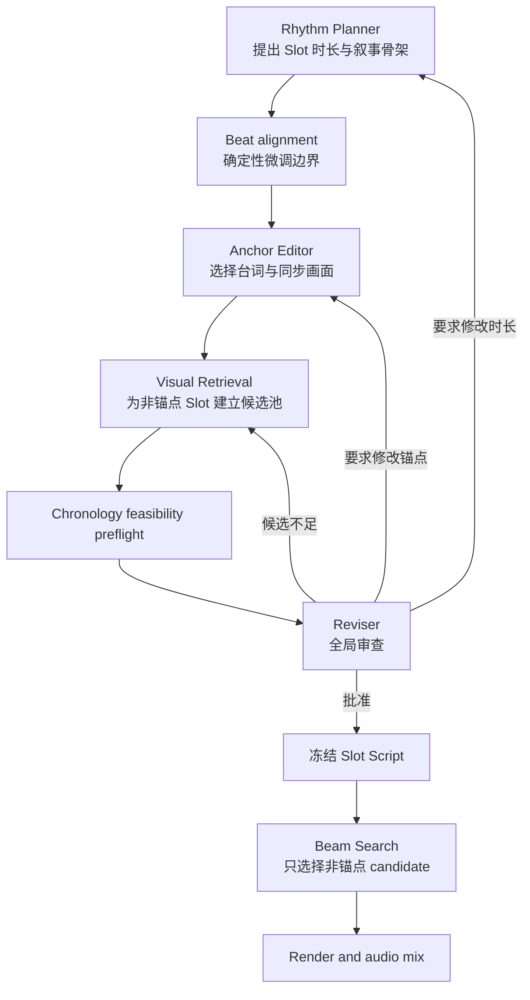

# Slot 规划多智能体研讨机制

本文定义 CutMaster 在 Beam Search 之前，通过多个专业智能体多轮研讨生成并冻结
Slot Script 的协作协议。

目标是将原本耦合的异构变量提前协商完成：

- Slot 数量、时长和叙事职责；
- 音乐节拍微调后的输出边界；
- 关键原声台词及其口型同步画面；
- 非锚点 Slot 的候选片段空间；
- 原片顺序、时长、身份、画面和锚点约束。

Slot Script 获得 Reviser 批准并冻结后，Beam Search 只负责为未绑定画面的 Slot
选择 `candidate_id`，不再修改 Slot 时长、锚点或候选池。

## 工作流边界



工作流分为两个阶段：

```text
多智能体研讨阶段：确定 S、A、C
确定性搜索阶段：只优化 P
```

其中：

- `S`：Slot 数量、叙事语义、时长和输出边界；
- `A`：原声锚点、源音频、同步视频和目标 Slot；
- `C`：每个非锚点 Slot 的候选池；
- `P`：Beam Search 最终选择的候选路径。

冻结之后不得回到研讨阶段静默修改状态。若 Beam Search 无解，说明冻结前的
feasibility preflight 不完整，应将本次规划判为失败并启动一个显式的新规划 revision。

## 协作原则

多智能体协作采用“顺序研讨 + 共享黑板”，不采用无结构的自由聊天，也不让智能体
直接互相调用。

```text
Canonical Planning State：现在的事实是什么
Discussion Events：为什么形成当前事实
Agent Response：建议下一步修改什么
Orchestrator：唯一有权提交状态修改的组件
```

模型原始 Prompt、隐藏推理过程和未经解析的原始响应不属于业务状态，不写入讨论历史。
讨论历史只保存通过响应契约解析后的决策摘要、Patch、请求、证据和应用结果。

即使暂时不考虑上下文长度，也不能仅把此前模型回答拼接给下一个智能体。聊天记录中
可能同时存在多个版本的 Slot 时长或锚点，而下一个智能体不应自行猜测哪个版本有效。
所有调用必须同时提供最新 Canonical Planning State。

## 智能体职责

### Rhythm Planner

Rhythm Planner 负责：

- 根据用户任务、音乐结构和原片概要提出 Slot 数量；
- 给每个 Slot 分配叙事职责、画面意图、情绪、动能和初始时长；
- 响应其他智能体提出的时长调整请求；
- 保证初始 Slot 时长总和满足目标输出时长。

Rhythm Planner 不负责：

- 选择具体台词；
- 选择源视频时间戳；
- 写入候选池；
- 直接决定 beat 对齐后的最终边界。

确定性 Beat Aligner 在 Rhythm Planner 返回后运行，按以下优先级局部微调边界：

```text
音乐段落边界 > downbeat > 强 beat > 普通 beat
```

Beat Aligner 不是智能体，不参与讨论。它只根据音乐分析和允许的最大偏移量更新输出
边界，并生成可审计的对齐记录。

### Anchor Editor

Anchor Editor 负责：

- 从完整台词中选择具有预告片叙事价值的关键原声；
- 将台词绑定到已经完成节拍微调的 Slot；
- 指定口型同步画面的源时间范围；
- 指定同步画面位于原声开头、结尾或完整覆盖；
- 判断原声是否可以在同步画面结束后继续覆盖 B-roll；
- 检查锚点密度、叙事价值、来源顺序和时长适配性。

Anchor Editor 可以直接修改锚点，但不能直接修改 Slot 时长。若台词放不进 Slot，只能
向 Rhythm Planner 提交定向请求。

### Visual Retrieval

Visual Retrieval 负责：

- 验证锚点的原声音频和同步画面是否来自同一原片时间；
- 验证同步窗口中说话人和口型是否可用；
- 为非锚点 Slot 检索指定数量的候选；
- 为原声继续覆盖 B-roll 的可填充区间检索候选；
- 使用 VLM 验证人物身份、画面内容和候选适用性；
- 返回每个 Slot 的候选容量和不可行原因。

Visual Retrieval 不得为了凑足候选而降低身份阈值、放宽禁用素材规则或静默改变
Slot 语义。候选不足时必须向上游智能体提出修改请求。

### Reviser

Reviser 是全局审查者，负责：

- 综合三位智能体的本轮结果；
- 阅读确定性校验和 chronology preflight；
- 评价叙事、音乐、锚点和视觉可行性；
- 批准当前 Slot Script；
- 或向指定智能体发送局部修改请求。

Reviser 不直接修改 Slot、锚点或候选池。它只能批准、拒绝或路由修改请求，防止其
绕过各专业智能体的职责边界。

## 权限矩阵

| 参与者 | 可以直接修改 | 只能提出请求 |
| --- | --- | --- |
| Rhythm Planner | Slot 数量、时长、叙事职责、画面意图、情绪和动能 | 锚点和候选修改 |
| Beat Aligner | 节拍微调后的输出边界 | 无 |
| Anchor Editor | 锚点绑定、台词范围、同步位置和原声覆盖方式 | Slot 时长和叙事意图调整 |
| Visual Retrieval | 候选池、候选证据和视觉可行性 | Slot 时长、锚点和画面意图调整 |
| Reviser | 批准状态、定向修改请求 | 所有业务内容修改 |
| Orchestrator | 校验并提交合法 Patch、维护 revision | 不产生创意规划内容 |

## Canonical Planning State

所有智能体共享同一个结构化状态。以下为概念结构，实际实现应放入强类型 contract，
并通过统一 JSON Schema 同时驱动 Prompt 模板和本地校验。

```json
{
  "planning_id": "planning_001",
  "revision": 8,
  "round": 3,
  "status": "discussing",
  "request": {
    "instruction": "围绕米娅剪一个追梦人物短片",
    "target_duration_sec": 60.0
  },
  "slot_plan": [],
  "anchors": [],
  "candidate_pool": {},
  "feasibility": {
    "slot_timeline_valid": false,
    "anchors_valid": false,
    "candidate_capacity_valid": false,
    "chronological_path_exists": false
  },
  "pending_requests": [],
  "dirty_components": [],
  "reviser": {
    "approved": false,
    "approved_revision": null
  }
}
```

`status` 使用明确生命周期：

```text
draft -> discussing -> approved -> frozen -> selected -> rendered
```

- `draft`：尚未完成第一轮 Rhythm Planner；
- `discussing`：智能体正在研讨，状态可以通过 Patch 更新；
- `approved`：Reviser 已批准，但冻结产物尚未完成最终校验和写入；
- `frozen`：Slot Script、锚点和候选池均不可修改；
- `selected`：Beam Search 已选择完整路径；
- `rendered`：音视频渲染完成。

## Slot Script

进入 Beam Search 前，Slot Script 必须包含所有输出时间线信息和候选选择约束：

```json
{
  "slot_id": "slot_04",
  "output_start_sec": 18.4,
  "output_end_sec": 23.2,
  "planned_duration_sec": 4.8,
  "narrative_role": "turning_point",
  "content_description": "Mia directly expresses her loss of confidence",
  "target_emotion": "devastation",
  "target_emotional_intensity": 0.9,
  "target_kinetic_energy": 0.2,
  "required_visible_subjects": ["Mia"],
  "binding": {
    "type": "anchor",
    "anchor_id": "anchor_01"
  }
}
```

普通 Slot 使用：

```json
{
  "binding": {
    "type": "candidate_pool",
    "candidate_ids": [
      "slot_03_candidate_01",
      "slot_03_candidate_02",
      "slot_03_candidate_03"
    ]
  }
}
```

冻结后，Beam Search 只能从 `candidate_ids` 中选择，不得扩大检索范围。

## 原声锚点

锚点同时约束输出音频、输出视频和源视频时间：

```json
{
  "anchor_id": "anchor_01",
  "target_slot_id": "slot_04",
  "dialogue_ids": [812, 813],
  "dialogue_text": "Maybe I'm not good enough.",
  "source_audio_range": {
    "start_sec": 5634.2,
    "end_sec": 5637.8
  },
  "sync_video_range": {
    "start_sec": 5634.2,
    "end_sec": 5636.0
  },
  "sync_position": "start",
  "audio_continues_over_broll": true,
  "selection_reason": "The line directly expresses the central setback"
}
```

锚点必须满足：

- `dialogue_ids` 存在、连续且顺序正确；
- `source_audio_range` 覆盖完整台词；
- `sync_video_range` 位于 `source_audio_range` 内或与其严格同步；
- 同步画面来自相同源时间，不能替换为相似镜头；
- 同步画面中说话人和口型可用；
- 锚点音频长度不超过它覆盖的输出区间；
- 锚点之间不重叠；
- 锚点遵守要求的原片时间顺序；
- 锚点不与候选的源时间范围冲突。

### J-cut 和 L-cut

当原声只在开头或结尾需要口型同步时，不将整个 Slot 锁定为固定画面。Slot 可以包含
多个原子 Part：

```json
{
  "slot_id": "slot_04",
  "parts": [
    {
      "part_id": "slot_04_part_01",
      "part_type": "anchor_sync",
      "output_start_sec": 18.4,
      "output_end_sec": 20.2,
      "fixed_source_range": {
        "start_sec": 5634.2,
        "end_sec": 5636.0
      }
    },
    {
      "part_id": "slot_04_part_02",
      "part_type": "voiceover_broll",
      "output_start_sec": 20.2,
      "output_end_sec": 23.2,
      "candidate_ids": []
    }
  ]
}
```

Beam Search 前可以将复合 Slot 编译为原子 Slot。`anchor_sync` 是固定节点，
`voiceover_broll` 是待选择节点。这样 Beam Search 不需要理解“半固定 Slot”。

## Discussion Event

每次智能体调用都生成一个追加式业务事件：

```json
{
  "event_id": "discussion_event_0012",
  "round": 3,
  "turn": 2,
  "agent": "anchor_editor",
  "base_revision": 7,
  "decision": "propose_changes",
  "assessment": {
    "agreements": [
      "The revised slot_04 can contain the selected dialogue"
    ],
    "concerns": [],
    "decision_summary": "Bind dialogue 812-813 to slot_04"
  },
  "patches": [],
  "requests": [],
  "evidence": [],
  "application": {
    "status": "applied",
    "resulting_revision": 8,
    "rejection_reason": null
  }
}
```

讨论事件保留的是模型的结构化结论，不保留：

- 完整 system prompt；
- 完整 user prompt；
- 模型隐藏推理；
- 未解析的原始响应正文；
- 图片的 base64 数据。

需要复核视觉证据时，事件保存 artifact ID、Shot ID、Segment ID、Candidate ID 或文件
路径引用。

## 统一 Agent Response

三个专业智能体和 Reviser 使用同一个响应外壳：

```json
{
  "agent": "visual_retrieval",
  "base_revision": 8,
  "decision": "request_revision",
  "assessment": {
    "agreements": [],
    "concerns": [
      "slot_06 has only one visually valid candidate"
    ],
    "decision_summary": "The current Slot plan is unsafe for Beam Search"
  },
  "patches": [],
  "requests": [
    {
      "request_id": "request_0021",
      "target_agent": "rhythm_planner",
      "operation": "shorten_slot",
      "target_id": "slot_06",
      "parameters": {
        "maximum_duration_sec": 3.6
      },
      "reason": "No three non-overlapping candidates can satisfy the current duration"
    }
  ],
  "evidence": [
    {
      "type": "candidate_capacity",
      "reference_ids": ["slot_06"],
      "summary": "Only one visually grounded candidate remains"
    }
  ]
}
```

`decision` 只能为：

```text
accept_current
propose_changes
request_revision
reject_current
approve
```

各 Agent 的响应契约应根据权限进一步限制允许的 Patch 和 Request operation。

## Prompt 上下文

每次模型调用使用统一上下文层次：

```text
1. Agent 身份、职责和写权限
2. 用户任务
3. 不可变的原片和音乐分析
4. 最新 Canonical Planning State
5. Discussion History
6. 上一个 Agent 的最新事件
7. 指向当前 Agent 的 pending requests
8. 本轮任务
9. Response Contract 与自动生成模板
```

即使第一版注入完整 Discussion History，也必须显式说明：

```text
Canonical Planning State is authoritative.
Earlier discussion may describe superseded revisions.
Never reconstruct current values from discussion history.
```

Agent 只需返回可审计的决策摘要，不要求输出隐藏思维链。

## Patch 事务

模型不能直接写 Planning State。Orchestrator 对每次响应执行事务：

```text
解析响应
  ↓
JSON Schema 校验
  ↓
Agent 权限校验
  ↓
base_revision 校验
  ↓
在状态副本上应用 Patch
  ↓
业务硬约束校验
  ↓
提交新 revision 或记录拒绝事件
```

### 乐观并发控制

每个响应必须携带 `base_revision`。只有它等于当前 State revision 时才能提交。即使未来
部分 Agent 并行调用，过期响应也不会覆盖较新的状态。

### Patch 原子性

一个响应中的 Patch 默认作为单个事务：

- 全部合法时一起提交；
- 任一 Patch 非法时整组拒绝；
- 拒绝事件必须记录具体 Patch 和原因；
- 被拒绝的 Patch 不进入 Canonical Planning State。

若需要允许部分应用，Agent 必须将独立修改拆成多个显式 transaction group，不能由
Orchestrator 猜测哪些 Patch 可以保留。

## 修改请求路由

智能体不能直接调用另一个智能体。请求统一进入：

```json
{
  "pending_requests": []
}
```

Orchestrator 根据 `target_agent` 在下一次合法调用中注入请求。请求状态为：

```text
pending -> accepted -> resolved
pending -> rejected
pending -> superseded
```

被拒绝时必须提供理由。Reviser 在批准前不得留下未解决的 blocking request。

## 失效传播

状态变更必须显式标记下游产物失效。

### Rhythm Planner 修改 Slot 数量、时长或边界

失效：

```text
受影响 Slot 的 anchor fit
受影响 Slot 的 candidate pool
相邻边界的 pairwise evidence
chronology preflight
Reviser approval
```

### Beat Aligner 调整输出边界

失效规则与时长修改相同，但只影响实际发生边界变化的 Slot。

### Anchor Editor 修改锚点

失效：

```text
锚点 Slot 及相邻可填充区间的 candidate pool
源时间冲突检查
chronology preflight
Reviser approval
```

### Visual Retrieval 修改候选池

失效：

```text
相关 pairwise evidence
chronology preflight
Reviser approval
```

状态使用结构化 dirty marker：

```json
{
  "dirty_components": [
    "anchor_fit:slot_04",
    "candidate_pool:slot_04",
    "pairwise:slot_03->slot_04",
    "chronology_preflight",
    "reviser_approval"
  ]
}
```

下一轮只重新计算脏数据，不需要无条件重跑所有智能体。

## 研讨回合

每轮使用固定顺序：

```text
Round N

1. Rhythm Planner 处理定向修改请求
2. Beat Aligner 微调受影响边界
3. Anchor Editor 保留、移动或替换受影响锚点
4. Visual Retrieval 重检受影响 Slot
5. Deterministic Validators
6. Chronology Feasibility Preflight
7. Reviser 批准或发出下一轮请求
```

第一轮没有上游请求时，所有阶段完整执行。后续轮次根据 dirty marker 跳过未受影响的
阶段。

概念伪代码：

```python
state = create_planning_state()
events = []

for round_index in range(1, max_rounds + 1):
    state.round = round_index

    if state.needs_rhythm_revision:
        response = call_rhythm_planner(state, events)
        state, event = validate_and_apply(response, state)
        events.append(event)
        state = align_dirty_boundaries(state)

    if state.needs_anchor_revision:
        response = call_anchor_editor(state, events)
        state, event = validate_and_apply(response, state)
        events.append(event)

    if state.needs_visual_retrieval:
        response = call_visual_retrieval(state, events)
        state, event = validate_and_apply(response, state)
        events.append(event)

    state.feasibility = run_hard_validators_and_preflight(state)
    review = call_reviser(state, events)
    events.append(review)

    if review.decision == "approve" and all_hard_checks_pass(state):
        freeze_approved_plan(state)
        break

    route_revision_requests(review, state)
```

## Chronology Feasibility Preflight

Reviser 批准前必须运行一次不以质量最优为目标的可行性搜索，回答：

```text
是否至少存在一条候选路径，能够：

- 覆盖全部输出 Slot；
- 经过所有固定锚点；
- 满足原片顺序要求；
- 不产生源时间重叠；
- 满足每个 Slot 的精确时长；
- 不与锚点音视频范围冲突。
```

Preflight 只证明存在完整路径，不决定最终候选。它可以使用动态规划或布尔 Beam，
不得因为某条路径质量较低而报告无解。

锚点天然将时间线分解为多个区间：

```text
开头 -> 锚点 A -> 锚点 B -> 锚点 C -> 结尾
```

各区间可以并行检查，再验证区间边界是否兼容。

## Reviser 批准条件

Reviser 只有在所有硬条件通过后才能执行主观审查。

### 时间线硬条件

- Slot 从 0 开始；
- Slot 连续、无空隙且无输出重叠；
- 总时长精确等于目标时长；
- 所有边界已经完成音乐微调；
- 所有 Slot 时长满足 contract。

### 锚点硬条件

- 台词 ID 和时间戳真实存在；
- 原声范围覆盖完整台词；
- 同步视频来自相同源时间；
- 口型同步窗口可用；
- 锚点不重叠；
- 锚点符合来源顺序；
- 锚点与候选无源时间冲突。

### 候选硬条件

- 每个非固定 Slot 达到要求的候选数量；
- 候选长度精确等于对应原子 Slot 时长；
- 候选时间范围互不重复；
- 候选通过人物身份和视觉内容校验；
- 候选不包含被策略禁止的字幕、Logo、版权卡或空白画面。

### 全局硬条件

- 所有 blocking request 已解决；
- `dirty_components` 为空；
- chronology preflight 存在完整路径；
- 当前 Reviser 调用基于最新 revision。

硬条件通过后，Reviser 再按 Likert 量表审查：

```json
{
  "narrative_structure": 4,
  "music_structure_match": 4,
  "anchor_dialogue_quality": 5,
  "anchor_distribution": 4,
  "visual_feasibility": 5,
  "overall_coherence": 4
}
```

每项评分都必须给出引用 Slot、Anchor、Dialogue 或 Candidate ID 的证据。批准阈值由配置
统一定义，不写死在 Prompt 中。

## 冻结产物

批准后写入 `approved_slot_plan.json`：

```json
{
  "status": "frozen",
  "planning_id": "planning_001",
  "revision": 8,
  "approved_by": "reviser",
  "slots": [],
  "anchors": [],
  "candidate_pool": {},
  "feasibility": {
    "slot_timeline_valid": true,
    "anchors_valid": true,
    "candidate_capacity_valid": true,
    "chronological_path_exists": true
  }
}
```

同时写入业务讨论记录 `planning_discussion.json`：

```json
{
  "schema_version": "1.0",
  "planning_id": "planning_001",
  "events": []
}
```

`approved_slot_plan.json` 是 Beam Search 的唯一输入。`planning_discussion.json` 只用于
开发期诊断和解释决策，不能被 Beam Search 当作隐式状态读取。

## Beam Search 契约

冻结后的 Beam Search：

- 接收只读 Slot Script、Anchor 和 Candidate Pool；
- 固定节点不参与候选选择；
- 只为可填充节点选择已有 `candidate_id`；
- 不调用 Rhythm Planner、Anchor Editor 或 Visual Retrieval；
- 不新增候选；
- 不调整 Slot 输出边界；
- 不移动锚点；
- 输出 selected path 和评分诊断。

若冻结后的候选池无解，应记录 invariant violation：

```text
frozen_plan_infeasible
```

不能在 Beam Search 内隐式扩大候选或重新规划。

## 终止条件

研讨在以下任一条件满足时终止：

### 成功

- Reviser 返回 `approve`；
- 所有硬校验通过；
- 没有 pending blocking request；
- 没有 dirty component；
- 冻结文件成功写入。

### 失败

- 达到最大研讨轮数；
- 连续两轮 State fingerprint 不变且 Reviser 仍不批准；
- 同一修改请求被拒绝后重复出现超过配置上限；
- 模型调用预算或时间预算耗尽；
- 没有任何可满足锚点与候选约束的 Slot 结构。

失败时保留最后一个有效 revision 和结构化失败原因，但不能把未批准状态交给
Beam Search。

## 状态指纹与防循环

每次提交后对以下字段计算稳定 fingerprint：

```text
slot_plan
anchors
candidate IDs and ranges
pending requests
dirty components
```

若 Reviser 在相同 fingerprint 上重复提出同一请求，Orchestrator 应将其标记为
`repeated_revision_request`，而不是无限继续调用。

## 日志

运行日志只记录阶段与结构化元数据，例如：

```text
planner.discussion | round.start
planner.rhythm | proposal.complete
planner.anchor | patch.applied
planner.visual | candidate_pool.updated
planner.discussion | request.routed
planner.preflight | validation.complete
planner.reviser | review.complete
planner.discussion | plan.frozen
```

日志不输出完整 Planning State、完整 Discussion Event 或台词全文。详细业务状态写入
JSON artifact，日志只记录：

- planning ID；
- round；
- revision；
- Agent；
- decision；
- Patch 数量；
- request 数量；
- dirty component 数量；
- 校验结果；
- 拒绝原因摘要。

## 建议的代码边界

实现时建议保持以下职责：

```text
planner/
├── discussion.py          # 研讨循环与请求路由
├── discussion_state.py    # Canonical State、Event、Patch contract
├── rhythm_planning.py     # Rhythm Planner 业务校验
├── dialogue_anchors.py    # Anchor Editor 业务校验
├── candidate_retrieval.py # Visual Retrieval
├── preflight.py           # 确定性可行性检查
├── sequence_selection.py  # 冻结后的 Beam Search
└── service.py             # Planner facade
```

Prompt 仍统一放在：

```text
prompting/planner/tasks.py
```

并新增明确任务：

```text
rhythm_planning
anchor_editing
visual_retrieval
plan_revision
```

业务模块不得自行拼接 Prompt。所有响应 contract 由 Prompt 中间层提供，并同时用于
提示模型和本地结构校验。

## 第一版实施范围

第一版应优先完成：

1. Canonical Planning State 与 revision；
2. 统一 Agent Response；
3. 三个 Agent 的权限与 Patch 校验；
4. 固定顺序研讨循环；
5. dirty component 失效传播；
6. chronology feasibility preflight；
7. Reviser 硬条件和批准协议；
8. `approved_slot_plan.json` 冻结边界；
9. Beam Search 只读冻结计划。

第一版可以向每个 Agent 注入完整 Discussion History，不处理上下文压缩。后续优化只
改变上下文选择策略，不改变 Canonical State、Event、Patch 和 revision 协议。
