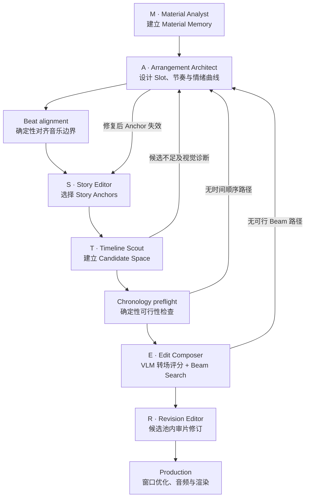

gt

# MASTER 多智能体剪辑机制

CutMaster 将长视频剪辑组织为 **MASTER Editing Team**：

```text
M     = Material Analyst
ASTER = Arrangement Architect
        Story Editor
        Timeline Scout
        Edit Composer
        Revision Editor
```

M 负责建立与具体剪辑任务无关的 Material Memory；ASTER 是共享同一规划状态的
五智能体剪辑团队。整个工作流由 `CutMaster` 统一启动，ASTER 内部协作由
`ASTERTeam` 编排。

## 设计目标

MASTER 将三个异构优化方向交给不同专业角色：

- **叙事导向**：Arrangement Architect 设计叙事推进，Story Editor 用关键原声
  锚定真实情节；
- **情绪导向**：Arrangement Architect 根据音乐结构、目标情绪和动能编排 Slot
  长度与剪辑节奏；
- **视觉质量导向**：Timeline Scout 建立经过视觉验证的候选空间，Edit Composer
  综合镜头质量与相邻转场；
- **全局质量控制**：Revision Editor 只在既有候选空间内修订，防止脱离已验证素材。

MASTER 不是六次互不相关的模型调用。每个 Editorial Agent 拥有明确输入、输出、
权限和失败语义，并可以调用确定性工具完成校验或搜索。

## 工作流



## 共享状态

各角色通过结构化规划状态协作，不通过自由聊天互相传递未验证文本：

```text
Material Memory
  -> Slot Arrangement
  -> Story Anchors
  -> Candidate Space
  -> Composed Edit
  -> Revised Edit
```

模型原始 Prompt、隐藏推理过程和未经解析的响应不属于业务状态。只有通过响应契约
和本地校验的结构化结果才能进入共享状态。`ASTERTeam` 是唯一有权协调角色调用、
提交修订和发起新 planning revision 的组件。

## M — Material Analyst

Material Analyst 将源视频转换为可复用 Material Memory：

- 检测完整 Shot 时间线；
- 获取并重建完整台词；
- 建立不切断 Shot 的 Segment；
- 标注 Shot 和 Segment 的视觉内容；
- 生成 Segment 摘要与全片故事摘要；
- 缓存可恢复的中间产物。

Material Analyst 不接收具体剪辑提示词，不决定输出 Slot，也不挑选最终镜头。

## A — Arrangement Architect

Arrangement Architect 负责：

- 根据用户请求、Material Memory 和音乐结构决定 Slot 数量；
- 为每个 Slot 定义叙事职责、画面意图、目标情绪和动能；
- 编排 Slot 时长和整体节奏；
- 在候选不足或时序不可行时进行定向局部修复；
- 保持 Slot 的原片 Segment 分配按时间递增。

Arrangement Architect 不选择具体台词和源时间窗口。Beat alignment 是它使用的
确定性工具，不是额外智能体。

## S — Story Editor

Story Editor 负责：

- 从 Slot 允许的原片范围中选择少量关键原声；
- 用人物弧光、冲突、决定、转折或主题表达锚定用户意图；
- 将连续台词和同步原画绑定到目标 Slot；
- 保证 Story Anchor 在原片时间、输出时间和台词范围上可验证。

Story Editor 产生的固定候选直接进入 Candidate Space。若 Arrangement Architect
的局部修复移走了 Anchor 所属 Segment，ASTERTeam 必须重新运行 Story Editor。

## T — Timeline Scout

Timeline Scout 负责：

- 沿原片时间线为非 Anchor Slot 搜索多个固定时长候选；
- 根据 Segment 容量逐轮扩大搜索范围；
- 用 VLM 检查人物身份、可见内容和 Slot 相关性；
- 直接测量候选运动强度并剔除静态画面；
- 保留拒绝证据，避免重复搜索失败窗口；
- 候选不足时向 ASTERTeam 返回结构化诊断。

Timeline Scout 建立的是 Candidate Space，而不是单个贪心答案。它不得为了补足数量
而静默降低身份阈值、复用禁用窗口或改变 Slot 意图。

## E — Edit Composer

Edit Composer 负责：

- 先检查 Candidate Space 是否存在按原片时间递增的路径；
- 计算候选的语义、情绪、动能、显著性和视觉相关性；
- 仅为当前存活 Beam 的边界延迟计算 VLM 转场评分；
- 以 Beam Search 组合全局候选路径；
- 生成完整但尚未最终审片的结构化剪辑脚本。

当前组合分数由单镜头质量和相邻镜头关系共同构成：

```text
composition_score = 0.60 × unary_score + 0.40 × pairwise_score
```

时间重叠是硬约束。Beam Search 无解时不会发明新时间戳，而是返回诊断并启动新的
规划 revision。

## R — Revision Editor

Revision Editor 负责：

- 结合用户请求、音乐结构、Slot Arrangement 和当前脚本进行最终审片；
- 只提交 `keep` 或 `replace` Patch；
- 替换候选必须来自对应 Slot 已验证的 Candidate Space；
- 接受的 Patch 组合不得破坏时序约束或降低已评分的完整路径。

Revision Editor 不增加 Slot、不改变 Slot 时长、不扩展 Candidate Space，也不发明
源时间戳。

## Agent 与 Tool 的边界

Agent 拥有编辑决策和业务责任；Tool 提供确定性能力：

| Agent                 | 典型 Tool                                       |
| --------------------- | ----------------------------------------------- |
| Material Analyst      | ASR、Shot detection、缓存、视频摘要校验         |
| Arrangement Architect | Music analysis、Beat alignment、Slot validation |
| Story Editor          | 台词连续性、同步范围与 Anchor 冲突校验          |
| Timeline Scout        | Segment media、容量检查、运动分析、视觉验证     |
| Edit Composer         | Chronology preflight、视觉评分、Beam Search     |
| Revision Editor       | Patch validation、路径重新评分                  |

Agent 可以同时使用 LLM、VLM 和确定性工具；“Agent”不等于一次模型调用。
Production 位于 ASTER 完成修订之后，不属于任何 Planner Agent 的私有工具。

## 生命周期

```text
materialized
  -> arranged
  -> anchored
  -> scouted
  -> composed
  -> revised
  -> rendered
```

每一次失败修复都必须形成显式 revision。已经确认的状态不得被后续角色静默覆盖。
